# WAD - Web Application Document - Módulo 2 - Inteli

## Grupo ID

#### Nomes dos integrantes do grupo

Anna Giulia Marques Riciopo

Cibele Figueredo Leal

Danilo Martins Merlo

Iasmim Santos Silva de Jesus

Jonathan Teodoro Alves

Leonardo Casal Andriolo

Pedro Pinheiro Rodrigues

## Sumário

[1. Introdução](#c1)

[2. Visão Geral da Aplicação _Web_](#c2)

[3. Projeto Técnico da Aplicação _Web_](#c3)

[4. Desenvolvimento da Aplicação _Web_](#c4)

[5. Testes da Aplicação _Web_](#c5)

[6. Conclusões e trabalhos futuros](#c6)

[7. Referências](#c7)

[Anexos](#c8)

<br>


# <a name="c1"></a>1. Introdução

&nbsp;&nbsp;&nbsp;&nbsp;O presente projeto, denominado DIVE, consiste no desenvolvimento de uma aplicação _web_ personalizada para o parceiro Dell Technologies, que visa aumentar a eficiência das linhas de montagem e diminuir o tempo de aprendizagem dos funcionários sobre alterações, melhorias e ajustes nos processos de montagem. A solução proposta tem o intuito de facilitar a interação entre engenheiros e montadores de forma prática, segura e organizada.

&nbsp;&nbsp;&nbsp;&nbsp;A motivação do parceiro para buscar um processo mais eficiente deriva da diversidade de tipos de produtos que montam, os quais possuem manuais de montagem que descrevem minuciosamente cada etapa de montagem e a ordem que elas devem ocorrer para aumentar a eficiência do processo, com alguns produtos possuindo mais de um manual.

&nbsp;&nbsp;&nbsp;&nbsp;O principal propósito do projeto é consolidar todos os manuais de montagem em um único lugar, ao mesmo tempo em que visa aprimorar o acesso dos montadores a esses manuais, otimizar as notificações sobre atualizações e tornar todo o processo mais eficiente.

&nbsp;&nbsp;&nbsp;&nbsp;A plataforma _web_ possuirá funções que atendem tanto os engenheiros quanto os montadores. Para os engenheiros, denominados administradores, buscamos fornecer dados úteis tempestivamente e possibilitar as ações de gerenciamento dos manuais. Do outro lado, para os montadores, denominados funcionários, buscamos criar uma plataforma intuitiva e direta, que mostre exatamente os manuais que precisam ser estudados.

&nbsp;&nbsp;&nbsp;&nbsp;Em suma, o projeto DIVE visa aprimorar a eficiência das linhas de montagem da Dell Technologies, consolidando todos os manuais de montagem em uma plataforma _web_ personalizada. Ao oferecer acesso simplificado e notificações instantâneas sobre atualizações, o DIVE busca facilitar a interação entre engenheiros e montadores, tornando todo o processo mais eficiente e reduzindo o tempo de aprendizagem dos funcionários.

# <a name="c2"></a>2. Visão Geral da Aplicação Web

## 2.1. Escopo do Projeto

### 2.1.1. Contexto da indústria

&nbsp;&nbsp;&nbsp;&nbsp; A Dell é uma empresa multinacional de tecnologia, fundada em 1984 nos Estados Unidos. Inicialmente focada na produção de _pocket computers_ (PCs) e notebooks para consumidores comuns, a empresa expandiu suas operações para o mercado corporativo e de serviços de tecnologia da informação. A aquisição da _EMC Corporation_ em 2016 marcou uma grande mudança, dando origem à Dell Technologies, dividida em duas partes: a _Dell Client Solutions Group_, que se concentra em produtos para consumidores individuais, e a _Dell EMC Infrastructure Solutions Group_, voltada para o mercado corporativo, nacional e internacionalmente.[¹](#c7) <br>

&nbsp;&nbsp;&nbsp;&nbsp;Dessa forma, a Dell consolidou sua posição como um dos principais _players_ na indústria de tecnologia, oferecendo soluções abrangentes e inovadoras para atender às crescentes demandas do mercado tecnologico que permanece em constante evolução. <br>

### 2.1.2. Modelo de 5 Forças de Porter

&nbsp;&nbsp;&nbsp;&nbsp; As Cinco Forças de Porter, propostas por Michael Porter, são um modelo analítico amplamente utilizado para entender a competitividade de um setor. Elas são: ameaça de novos entrantes, poder de barganha dos compradores, poder de barganha dos fornecedores, ameaça de produtos substitutos e intensidade da rivalidade entre os concorrentes. Este modelo oferece uma estrutura concisa para avaliar a dinâmica competitiva de um mercado específico.

&nbsp;&nbsp;&nbsp;&nbsp; Ao explorar a indústria de tecnologia, particularmente o segmento de computadores e _hardware_, percebemos a influência marcante dessas forças. Neste contexto, examinaremos como as características distintivas desse setor influenciam a estratégia e o posicionamento competitivo da Dell, destacando a necessidade contínua de inovação e diferenciação para sustentar sua liderança.

<div align="center"> <sub> Figura 1 — 5 Forças de Porter </sub>
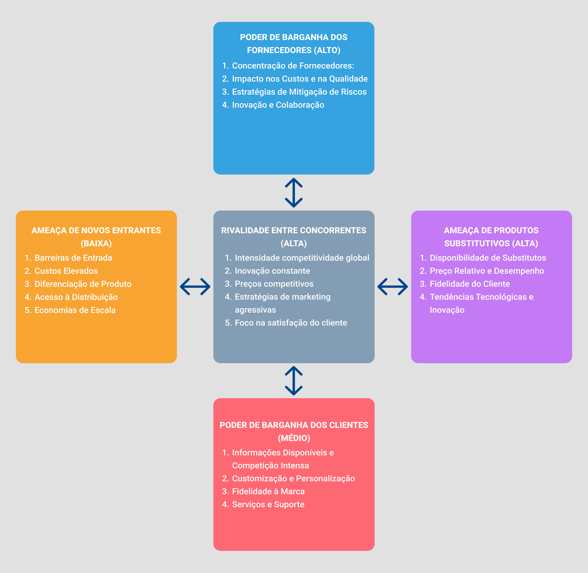<br>
<sup> Fonte: Material produzido pelos autores (2024).</sup> </div> <br>


#### Ameaça de novos entrantes (BAIXA):

**1. Barreiras de Entrada:** A indústria de tecnologia possui significativas barreiras de entrada, como alto investimento inicial, constante investimento em P&D e alta concorrência. A Dell Technologies já estabeleceu uma marca forte, possui economias de escala e uma ampla rede de distribuição, além de investimentos pesados em P&D e tecnologia.

**2. Custos Elevados:** Como citado anteriormente, os custos iniciais para entrar no mercado de tecnologia são substanciais. Isso inclui pesquisa e desenvolvimento, fabricação, _marketing_ e distribuição. A Dell já tem uma base estabelecida e pode distribuir os custos ao longo de suas operações globais, tornando-a mais competitiva em termos de custos.

**3. Diferenciação de Produtos:** A necessidade de diversificação dos produtos fornecidos e o foco na inovação contínua dificultam a entrada de novos concorrentes que não possuem as mesmas capacidades de P&D e recursos. A Dell tem uma variedade de produtos e serviços, desde hardware até soluções de _software_ e serviços de consultoria, e possui um grande foco em manter-se sempre inovando e otimizando seus objetivos.

**4. Acesso à Distribuição:** A Dell possui uma ampla rede de distribuição global, incluindo parcerias com revendedores e canais _online_. Entrar nesse espaço requer a construção ou aquisição de uma rede de distribuição comparável, o que pode ser uma tarefa difícil e demorada para novos concorrentes.

**5. Economias de Escala:** A Dell Technologies já alcançou economias de escala significativas em sua produção e operações. Isso reduz os custos unitários e aumenta a eficiência, tornando difícil para novos concorrentes competirem em termos de preço.

&nbsp;&nbsp;&nbsp;&nbsp; A ameaça de entrada de novos concorrentes na indústria de tecnologia para a Dell Technologies é relativamente baixa devido às barreiras de entrada substanciais, custos elevados de entrada, diferenciação de produtos, acesso à distribuição e economias de escala. No entanto, continuar monitorando o ambiente competitivo e inovando faz-se necessário para manter sua posição de liderança no mercado.

#### Ameaça de produtos substitutos (ALTA):

**1. Disponibilidade de Substitutos:** Na indústria de tecnologia, os produtos substitutos são muito presentes. Em vez de comprar computadores desktop ou laptops da Dell, os consumidores podem optar por tablets, smartphones ou até mesmo dispositivos da concorrência, como HP, Lenovo ou Apple. Além disso, serviços de computação em nuvem podem substituir a necessidade de _hardware_ físico.

**2. Preço Relativo e Desempenho:** A decisão de substituir um produto da Dell por um substituto muitas vezes depende do preço relativo e do desempenho. Se um substituto oferecer desempenho semelhante a um preço mais baixo, os consumidores podem optar por mudar. Além disso, se um substituto oferecer recursos adicionais ou uma experiência de usuário superior, isso pode aumentar a ameaça de substituição.

**3. Fidelidade do Cliente:** A fidelidade do cliente à marca e aos produtos da Dell pode reduzir a ameaça de substituição. Se os clientes estiverem satisfeitos com os produtos, serviços e suporte da Dell, eles podem ser menos propensos a considerar alternativas.

**4. Tendências Tecnológicas e Inovação:** As mudanças rápidas na tecnologia e a constante inovação podem aumentar a disponibilidade de produtos substitutos. Por exemplo, avanços em dispositivos móveis e serviços de computação em nuvem podem tornar essas opções mais atraentes em comparação com os produtos tradicionais da Dell.

&nbsp;&nbsp;&nbsp;&nbsp; A ameaça de produtos substitutos na indústria de tecnologia para a Dell Technologies é significativa, considerando a ampla gama de opções disponíveis para os consumidores, incluindo dispositivos móveis, serviços de nuvem e produtos concorrentes. A empresa precisa continuar inovando, oferecendo valor agregado e mantendo a satisfação do cliente para mitigar essa ameaça. Além disso, investimentos contínuos em pesquisa e desenvolvimento são essenciais para manter a relevância no mercado em constante evolução.[²](#c7)

#### Poder de Barganha dos Fornecedores (ALTA):

**1. Concentração de Fornecedores:** A Dell possui múltiplos fornecedores, mas certos segmentos do mercado podem ser monopolizados por poucas empresas. Isso pode conferir a esses fornecedores dominantes uma vantagem de negociação, especialmente se oferecerem produtos ou serviços exclusivos ou altamente especializados. Por exemplo, no setor de processadores, a Intel e a AMD exercem uma influência substancial e possuem uma posição de negociação vantajosa sobre a Dell.

**2. Impacto nos Custos e na Qualidade:** Fornecedores com poder de barganha elevado podem aumentar os preços, impor prazos desfavoráveis e restringir o acesso a componentes essenciais, impactando diretamente na lucratividade e competitividade da empresa, assim como prejudicando a qualidade final dos produtos.

**3. Estratégias de Mitigação de Riscos:** Uma das alternativas para o gerenciamento da influência dos fornecedores é o emprego de uma abordagem multifacetada: diversificação de fontes, contratos sólidos, parcerias estratégicas de longo prazo e verticalização em áreas-chave da cadeia de suprimentos.

**4. Inovação e Colaboração:** Procura não apenas reduzir os riscos ligados aos fornecedores, mas também fomentar a inovação e a colaboração com eles. Isso envolve parcerias em pesquisa e desenvolvimento, compartilhamento de práticas eficazes e criação conjunta de soluções tecnológicas avançadas.

&nbsp;&nbsp;&nbsp;&nbsp; O poder de barganha dos fornecedores representa uma força significativa na análise estratégica da Dell Technologies. Devido à natureza do setor de tecnologia, a disponibilidade e a qualidade dos componentes eletrônicos são críticas para a produção eficiente dos produtos da Dell, como _laptops_, _desktops_ e servidores. Isso confere aos fornecedores um alto poder de negociação, especialmente em momentos de escassez de oferta ou flutuações nos preços das matérias-primas, impactando diretamente os custos de produção da Dell e sua capacidade de competitividade no mercado.

#### Poder de Barganha dos Clientes (MÉDIA):

**1. Informações Disponíveis e Competição Intensa:** Compradores no setor de tecnologia, incluindo empresas e consumidores finais, têm acesso a uma ampla gama de informações sobre produtos, preços, avaliações e comparativos. Isso aumenta sua capacidade de tomar decisões informadas e de comparar ofertas de diferentes empresas.

**2. Customização e Personalização:** Uma das estratégias da Dell é oferecer produtos altamente personalizáveis, como computadores e servidores sob medida. Isso dá aos compradores um maior poder de negociação, pois podem especificar exatamente o que desejam e comparar os preços com base nessas especificações.

**3. Fidelidade à Marca:** Embora a Dell tenha uma base de clientes leais, especialmente no segmento corporativo, a fidelidade à marca não elimina completamente o poder de negociação dos compradores. Eles ainda podem buscar alternativas se encontrarem ofertas mais atraentes em termos de preço, qualidade ou serviço.

**4. Serviços e Suporte:** Além do produto em si, os compradores também consideram os serviços pós-venda e o suporte oferecido pela Dell e por seus concorrentes. Isso influencia suas decisões de compra e pode afetar a negociação de preços e condições contratuais.

&nbsp;&nbsp;&nbsp;&nbsp; O poder de negociação dos compradores se refere à capacidade dos compradores de influenciar os preços, as condições de venda e a qualidade dos produtos ou serviços oferecidos pela empresa. Na indústria de tecnologia, especialmente em segmentos como hardware e software, os compradores têm um papel significativo devido à sua habilidade de comparar facilmente produtos e serviços, além da disponibilidade de informações online sobre preços e características.

#### Rivalidade entre concorrentes (ALTA):

**1. Intensidade competitividade global:** A arena competitiva da indústria de tecnologia é altamente disputada e estende-se globalmente, com várias empresas que vendem produtos semelhantes buscando conquistar mercados emergentes e estabelecidos. Essa expansão aumenta a rivalidade, pois a empresa compete não apenas com concorrentes locais, mas também com _players_ globais, como HP, Lenovo, Apple, entre várias outras.

**2. Inovação constante:** A rivalidade é alimentada pela constante busca por lançamentos mais avançados e atrativos para os consumidores. Isso inclui melhorias de desempenho, novos recursos e funcionalidades e designs inovadores.

**3. Preços competitivos:** As empresas frequentemente reduzem os preços para atrair clientes, resultando em margens de lucro apertadas e pressão constante sobre os preços.

**4. Estratégias de marketing agressivas:** Investimentos significativos são feitos em campanhas de marketing para conquistar a atenção do consumidor. Aqui há a inclusão de publicidade em diversos canais, patrocínios de eventos e parcerias estratégicas.

**5. Foco na satisfação do cliente:** Empresas investem em serviços, suporte técnico e fidelização para manter a satisfação e lealdade dos clientes.

&nbsp;&nbsp;&nbsp;&nbsp; Em síntese, a análise das 5 forças de Porter oferece uma visão abrangente dos desafios e oportunidades que a Dell Technologies enfrenta em seu ambiente competitivo. Ao entender essas forças, podemos desenvolver estratégias eficazes para a criação de produtos e serviços que aumentem a competitividade da empresa.

### 2.1.3. Análise SWOT

&nbsp;&nbsp;&nbsp;&nbsp; A análise SWOT é uma ferramenta estratégica fundamental para avaliar as forças, fraquezas, oportunidades e ameaças de uma empresa ou projeto. Essa análise fornece uma visão abrangente do ambiente interno e externo, permitindo identificar vantagens competitivas, áreas de melhoria e potenciais desafios de uma determinada empresa.<br>

&nbsp;&nbsp;&nbsp;&nbsp; Com base nessa abordagem, foi elaborada a seguinte matriz SWOT para a Dell:

<div align="center"> <sub> Figura 2 — Análise SWOT </sub>
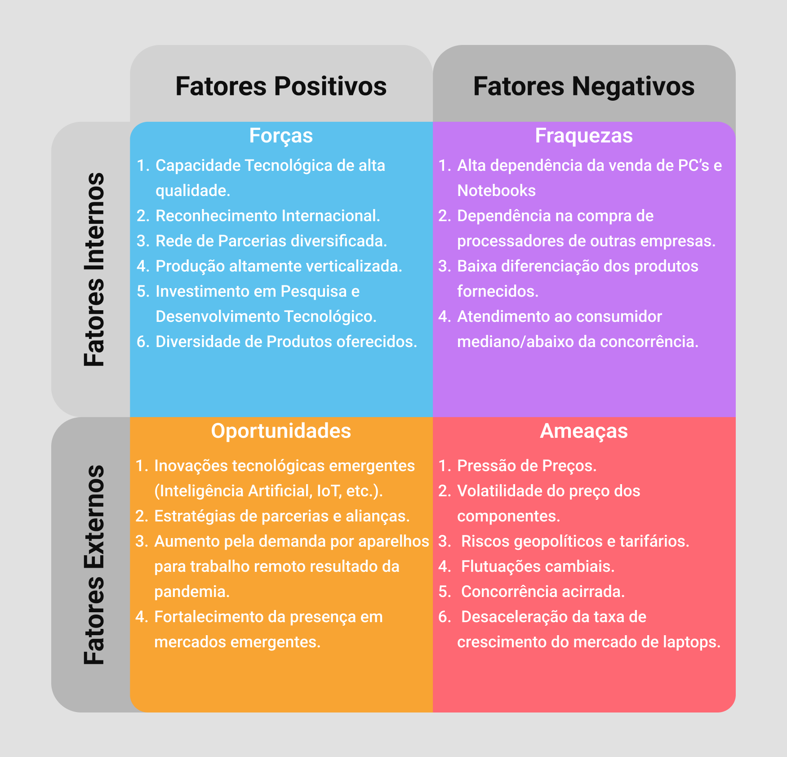<br>
<sup> Fonte: Material produzido pelos autores (2024).</sup> </div> <br>

#### Forças

**1. Capacidade Tecnológica de alta qualidade:** A Dell é reconhecida por sua excelência técnica, especialmente no desenvolvimento e fabricação de _hardware_, investindo constantemente em tecnologia avançada para garantir a eficácia e eficiência de seus produtos.

**2. Reconhecimento Internacional:** A Dell possui uma marca globalmente consolidada, reconhecida pela qualidade e confiabilidade de seus produtos, com presença em mais de 180 países.

**3. Rede de Parcerias diversificada:** A Dell estabelece parcerias estratégicas com _startups_, instituições educacionais e empresas de _software_ para impulsionar a inovação e ampliar sua presença no mercado.

**4. Produção altamente verticalizada:** A capacidade da Dell de produzir seus próprios componentes confere vantagem competitiva ao controlar os custos de produção e mitigar volatilidades do mercado.

**5. Investimento em Pesquisa e Desenvolvimento Tecnológico:** O alto investimento da Dell em pesquisa e desenvolvimento a mantém na vanguarda tecnológica, possibilitando o desenvolvimento de soluções que otimizam seus processos de produção.

**6. Diversidade de Produtos oferecidos:** A Dell oferece uma variedade de produtos, como PCs, _notebooks_, periféricos, servidores e soluções de armazenamento, atendendo a diversos segmentos de mercado.

#### Fraquezas

**1. Alta dependência da venda de PC’s e Notebooks:** A Dell tem uma dependência significativa das vendas de _notebooks_ e PCs, o que torna sua receita suscetível a volatilidades nos preços ou na demanda desses produtos.

**2. Dependência na compra de processadores de outras empresas:** A dependência da Dell de fornecedores externos para componentes essenciais, como processadores, pode representar uma fraqueza devido ao alto poder de barganha desses fornecedores.

**3. Baixa diferenciação dos produtos fornecidos:** A concorrência acirrada no mercado tecnológico pode dificultar a retenção de clientes pela Dell devido à percepção de produtos não diferenciados em relação aos concorrentes.

**4. Atendimento ao consumidor mediano/abaixo da concorrência:** De acordo com uma pesquisa realizada pelo Laptop Mag 's 2023 Tech Support Showdown, em 2023, a DELL ficou em quarto lugar em melhores empresas de atendimento ao consumidor, obtendo uma pontuação de 80/100, ficando assim, atrás de empresas concorrentes como Apple e Lenovo, algo que pode influenciar diretamente na decisão de compra dos clientes.

#### Oportunidades

**1. Inovações tecnológicas emergentes (Inteligência Artificial, IoT, etc.):** A Dell pode aproveitar seu conhecimento em _hardware_ e _software_ para integrar tecnologias emergentes em seus produtos e serviços, atendendo às demandas crescentes por eficiência, automação e análise de dados em vários setores.

**2. Estratégias de parcerias e alianças:** A Dell pode explorar oportunidades estratégicas de parcerias e alianças com empresas líderes em tecnologia e serviços para expandir seu alcance global, aprimorar suas ofertas de produtos e serviços e fortalecer sua posição competitiva em um mercado cada vez mais dinâmico e interconectado.

**3. Aumento da demanda por aparelhos para trabalho remoto resultado da pandemia:** A Dell pode fortalecer sua posição competitiva através de parcerias estratégicas com empresas líderes em tecnologia, expandindo seu alcance global e aprimorando suas ofertas de produtos e serviços.

**4. Fortalecimento da presença em mercados emergentes:** A expansão da presença em mercados emergentes permite à Dell adaptar suas ofertas, expandir sua rede de distribuição e investir em estratégias de _marketing_ para impulsionar o crescimento e aumentar sua participação de mercado nessas regiões em rápido desenvolvimento.

#### Ameaças

**1. Pressão de Preços:** A Dell enfrenta a ameaça da pressão de preços devido à concorrência acirrada no mercado de tecnologia, exigindo uma gestão cuidadosa dos custos e uma estratégia de precificação competitiva para manter sua posição.

**2. Volatilidade do preço dos componentes:** A volatilidade nos preços dos componentes tecnológicos representa uma ameaça para a Dell, afetando os custos de produção e a competitividade da empresa.

**3. Riscos geopolíticos e tarifários:** Os riscos geopolíticos, incluindo disputas comerciais e mudanças nas políticas internacionais, representam uma ameaça para a Dell devido a possíveis aumento dos custos de produção e interrupções nas cadeias de suprimentos globais.

**4. Flutuações cambiais:** As flutuações cambiais representam uma ameaça para a Dell, devido à sua presença global, impactando custos, receitas e lucratividade, exigindo estratégias de hedge eficazes.

**5. Concorrência acirrada:** A concorrência acirrada no mercado de tecnologia representa uma ameaça para a Dell, exigindo constante inovação e diferenciação para manter sua competitividade.

**6. Desaceleração da taxa de crescimento do mercado de laptops:** A desaceleração no crescimento do mercado de _laptops_ ameaça a Dell, requerendo diversificação do portfólio e adaptação às mudanças nas preferências dos consumidores.

&nbsp;&nbsp;&nbsp;&nbsp; Por fim, essa Análise SWOT trouxe uma descrição sobre os fatores internos e externos da Dell. Assim, a análise nos auxiliou a ter um melhor entendimento da dinâmica de mercado da empresa.

### 2.1.4. Solução

&nbsp;&nbsp;&nbsp;&nbsp;O treinamento dos funcionários que trabalham nas linhas de montagem da fábrica da empresa é uma questão importante a ser abordada. Neste contexto, é proposta a implementação do DIVE (_Dell_ _Interactive_ _Virtual_ _Environment_), um ambiente virtual personalizado desenvolvido pela Dell. O DIVE consiste em uma aplicação web projetada para facilitar a interação entre engenheiros e montadores, possibilitando a atualização e o ensino eficiente dos métodos de construção dos produtos.<br>

&nbsp;&nbsp;&nbsp;&nbsp;Esta solução será exclusivamente utilizada na fábrica da Dell, dentro de sua rede _Wi-Fi_, visando garantir a segurança dos manuais. Os engenheiros, responsáveis pela produção e atualização dos manuais, serão os administradores do DIVE. Sua função será fazer o upload dos manuais atualizados, designando-os para funcionários específicos de acordo com a necessidade identificada.<br>

&nbsp;&nbsp;&nbsp;&nbsp;O DIVE proporcionará uma melhoria significativa na relação entre engenheiros e montadores, de maneira prática, segura e organizada. Os administradores poderão disponibilizar os manuais especificamente para os funcionários desejados e os funcionários serão alertados sobre as atualizações por meio de uma aba de notificação. Após a leitura dos manuais, os montadores deverão marcar o _status_ como 'Concluído', possibilitando que o engenheiro responsável controle quem completou o treinamento.<br>

&nbsp;&nbsp;&nbsp;&nbsp;A medida de sucesso desta implementação será avaliada com base no aumento da produtividade geral da fábrica, na redução da taxa de erros de produção e na diminuição do tempo médio necessário para completar o treinamento de todos os funcionários. Estes parâmetros serão avaliados comparativamente, antes e depois da aplicação da solução, uma análise que será conduzida pela própria Dell.<br>

### 2.1.5. Proposta de Valor

&nbsp;&nbsp;&nbsp;&nbsp; O Canva Proposta de Valor é uma ferramenta que se divide em duas partes, o Perfil do Cliente e a Proposta de Valor, o primeiro auxilia o usuário dela a entender as necessidades de seu consumidor, e a segunda o ajuda a desenvolver um produto ou serviço que atenda tais necessidades.

&nbsp;&nbsp;&nbsp;&nbsp; O Perfil do Cliente se divide em três partes: nos "Ganhos" são listados os benefícios (tempo, dinheiro, contribuições ou até benefícios emocionais) que o consumidor gostaria ou seria positivamente surpreendido caso ocorressem; nas "Dores" são listadas as frustrações que o consumidor se depara atualmente, podem ser problemas, impedimentos ou até sentimentos negativos; e nas "Tarefas do Clientes" são listados as obrigações/desafios que o consumidor passa diariamente sem o auxilio do produto.

&nbsp;&nbsp;&nbsp;&nbsp; A Proposta de Valor se divide em outras três partes. Nos "Criadores de Ganhos" estão inseridas as características do produto que garantem os "Ganhos" definidos do consumidor. Em "Analgésicos", estão os fatores do produto que resolvem ou minimizam as "Dores" dos consumidores. E, finalmente, em "Produtos e Serviços" é descrito qual é a solução e uma breve descrição dela.

&nbsp;&nbsp;&nbsp;&nbsp; Dito isso, segue a imagem do Canva Proposta de Valor do nosso projeto.

<div align="center"> <sub> Figura 3 — Canva Proposta de Valor </sub>
<br>
<sup> Fonte: Material produzido pelos autores (2024).</sup> </div>

&nbsp;&nbsp;&nbsp;&nbsp; O uso desse Canva no nosso escopo do projeto, nos auxiliou a garantir um melhor entendimento da realidade atual do nosso público-alvo, suas necessidades, dores e desejos. Assim, idealizamos um produto que seja condizente com as necessidades do nosso consumidor.

### 2.1.6. Matriz de Riscos

&nbsp;&nbsp;&nbsp;&nbsp; A Matriz de Riscos é uma ferramenta de análise de negócios utilizada para gerenciar riscos. Através de dados dispostos em uma matriz colorida com os impactos nas linhas e a probabilidade nas colunas, é possível identificar quais são os riscos que devem receber mais atenção e energia em seu gerenciamento de uma maneira mais visual.

&nbsp;&nbsp;&nbsp;&nbsp; Sendo assim, é possível observar a aplicação da Matriz de Riscos ao projeto na imagem abaixo:

<div align="center"> <sub> Figura 4 — Matriz de Riscos </sub>
<br>
<sup> Fonte: Material produzido pelos autores (2024).</sup> </div>

#### Plano de ação para as ameaças:

**1. Baixa qualidade dos materiais fornecidos:** Estabelecer uma comunicação assertiva com os fornecedores dos materiais visando sempre a plena satisfação;

**2. Mal esclarecimento das dúvidas:** Validar com o professor orientador e com a turma as perguntas a serem realizadas ao parceiro;

**3. Mal entendimento da proposta:** Formular boas perguntas que estejam sempre muito bem alinhadas com o escopo do projeto para serem apresentadas aos parceiros nas sprints de validação;

**4. Não se adequar às personas criadas:** Revisar e refinar as personas através de testes que se destinam a quem o projeto planeja atingir;

**5. Falta de comprometimento dos membros da equipe:** Através da metodologia SCRUM é possível eliminar esse risco por meio de uma comunicação clara e transparente, metas realistas e muito bem estabelecidas e modelamento do comportamento desejado pelos membros da equipe.

**6. Falta de conhecimento técnico da equipe:** Implementação de aulas, curso e treinamentos em cima dos assuntos em carência, tendo em vista prevenção e diminuição de possíveis limitações de conhecimentos técnicos. Ainda é possível reter conhecimento através dos instrutores e colegas com maiores capacitações;

**7. Divergência de ideias:** Estabelecer um ambiente seguro e de confiança, em que os componentes da equipe se sintam confortáveis para expressar as suas ideias, mas é importante saber lidar com elas e abraçar as possibilidades na medida do possível, unindo as ideias que se conectam;

**8. Atraso nas entregas:** É importante dar atenção para uma boa gestão do tempo, sabendo gerenciar, também, as tarefas em ordem de prioridade. Além disso, evitar fugir do escopo poupa a necessidade de retrabalho.

#### Plano de ação para aproveitar as oportunidades:

**1. Aprendizado relevante durante a elaboração do projeto:** Durante a elaboração da solução, haverá muitas trocas entre o parceiro e o time, possibilitando, assim, aprendizado para ambas partes;

**2. Criação de network com os parceiros:** A realização do projeto abre portas de _networking_ tanto para o parceiro quanto para o time, facilitando algumas operações;

**3. Criação de uma solução eficiente:** Ao fim do projeto e implantação da plataforma, a solução será responsável por aumentar a produtividade dos colaboradores e capacitar de melhor forma os novos colaboradores.

&nbsp;&nbsp;&nbsp;&nbsp;Por meio da Matriz de Riscos é possível identificar, avaliar e gerenciar os riscos que podem impactar o sucesso do projeto. Os planos de ação descritos para cada risco e oportunidade auxiliam a mitigar os riscos e aproveitar as oprtunidades, garantindo a entrega de uma solução eficiente e benéfica para todos os envolvidos.


## 2.2. Personas

&nbsp;&nbsp;&nbsp;&nbsp; A criação das personas exige uma análise detalhada sobre as principais características dos clientes, como: ocupação, nível de escolaridade e formação, faixa etária, objetivos, frustrações e necessidades. Assim, é elaborado um personagem fictício, ou melhor, uma representação do cliente ideal, o qual é descrito com base nos dados coletados previamente.

&nbsp;&nbsp;&nbsp;&nbsp; Dessa forma, para esse projeto foram desenvolvidas duas personas, Gabriela e Felipe, representando uma administradora e um montador, respectivamente. A seguir, está disponível a descrição precisa de ambos os personagens:

<div align="center"> <sub> Figura 5 — Persona do Administrador </sub>
<br>
<sup> Fonte: Material produzido pelos autores (2024).</sup> </div>

<div align="center"> <sub> Figura 6 — Persona do Membro </sub>
<br>
<sup> Fonte: Material produzido pelos autores (2024).</sup> </div>

&nbsp;&nbsp;&nbsp;&nbsp; Com os dois elaborados, diversos recursos essenciais da aplicação _web_ foram definidos. A título de exemplo, foi concluído que a visualização para usuários identificados como membros deveria ser clara e direta, a fim de ocupar o menor tempo possível do dia do montador. Essa decisão foi tomada a partir da percepção sobre as necessidades desses clientes, os quais querem realizar suas tarefas em um curto espaço de tempo, para que possam ter mais tempo de lazer, por exemplo.

&nbsp;&nbsp;&nbsp;&nbsp; Por outro lado, com a elaboração das personas, foi reconhecido que os administradores pontuam como de extrema importância o acompanhamento da leitura dos manuais pelos montadores. Portanto,  a ordem de prioridade para o desenvolvimento dos recursos do projeto foi modificada, ou seja, um painel de controle com as estatísticas e os dados sobre cada manual ou funcionário vai ter preferência durante a elaboração da aplicação.

&nbsp;&nbsp;&nbsp;&nbsp;As personas "Gabriela" e "Felipe" foram desenvolvidas com base em uma análise detalhada das características dos clientes, visando a comprensão do usúário para atender às suas necessidades da melhor forma. Essa abordagem garante que a aplicação web atenda de forma eficaz às expectativas e demandas de seus usuários, resultando em uma experiência mais satisfatória e produtiva para os perfis.

## 2.3. User Stories

&nbsp;&nbsp;&nbsp;&nbsp;As _User Stories_ são, essencialmente, uma técnica utilizada no desenvolvimento de _software_ para capturar requisitos a partir da perspectiva do usuário. Elas consistem em descrições detalhadas de interações específicas entre o usuário e o produto ou serviço em questão. Este método proporciona uma narrativa que descreve não apenas o que o usuário está tentando alcançar, mas também as ações que ele toma para atingir seus objetivos e seus sentimentos ao longo desse processo. A utilização de _User Stories_ contribui significativamente para a criação de uma compreensão abrangente dos usuários e, consequentemente, para o desenvolvimento de soluções de _design_ que atendam de forma eficaz às suas necessidades e expectativas.

&nbsp;&nbsp;&nbsp;&nbsp;Com base nos benefícios gerados a partir das _User Stories_, foram desenvolvidas diferentes _User Stories_ para melhor compreensão das necessidades dos usuários:

<div align="center">
    <sub> Tabela 1: User Story T001</sub>
</div>

| Identificação  | T001                     |
| -------------  | ------------------------ |
| **Persona**    | Felipe, montador da Dell |
| **User Story** | "Como um montador da equipe de chão de fábrica da Dell, desejo acessar um catálogo de manuais designados para eu estudar ou revisar de forma eficiente, garantindo que eu tenha acesso às informações necessárias para o trabalho de montagem”
**Critérios de aceite** | **CR01**: O usuário deve ter acesso a plataforma _web_ da Dell Technologies para treinamento de funcionários do chão de fábrica.<br>**a.** Usuário preenche os campos de e-mail e senha com credenciais válidas de funcionário e clica no botão de entrar.<br>- _Login_ bem-sucedido: Correto. <br> - _Login_ falha: Errado, deve ser corrigido. <br><br> **CR02**: Após realizar o _login_ na conta de funcionário, o montador deve ser redirecionado diretamente para a tela de visualização de manuais para montadores da plataforma, em que poderá visualizar os manuais que precisa estudar ou revisar.<br> **a.** Usuário é direcionado para a tela de visualização de manuais para montadores da plataforma.<br> - Montador é redirecionado: Correto.<br>- Montador não é redirecionado para a tela correta: Errado, deve ser corrigido.<br>**b.** Após redirecionado, o montador deve ser capaz de visualizar o catálogo de manuais designados para ele estudar ou revisar sem precisar clicar.<br>- Montador conseguiu visualizar o catálogo de manuais designados para ele sem precisar clicar: Correto.<br>- Montador não conseguiu visualizar o catálogo de manuais designados para ele sem precisar clicar: Errado, deve ser corrigido.<br>


<div align="center">
    <sup> Fonte: Material produzido pelos autores (2024)</sup>
</div>

<div align="center">
    <sub> Tabela 2: User Story T002</sub>
</div>

| Identificação  | T002                     |
| -------------  | ------------------------ |
| **Persona**    | Felipe, montador da Dell |
| **User Story** | "Como um montador da equipe de chão de fábrica da Dell, desejo que o acesso aos manuais seja rápido e prático, para que eu evite perder tempo procurando o que tenho que fazer."
**Critérios de aceite** | **CR01**: Ao entrar na tela de visualização de manuais, o montador deve ter acesso à aba “A Fazer” como primeira tela que irá conter os manuais que precisa estudar ou revisar como prioritários.<br>**a.** Montador é direcionado para a tela de visualização de manuais para montadores da plataforma.<br>- Montador for redirecionado: Correto.<br>- Montador não é redirecionado para a tela correta: Errado, deve ser corrigido.<br>**b.** A aba “A Fazer” é a primeira tela apresentada ao montador.<br>- A aba "A Fazer" é a primeira tela: Correto.<br>- Outra aba é apresentada como primeira tela: Errado, deve ser corrigido.<br><br> **CR02**: Ao entrar na tela de visualização de manuais, o montador deve ter acesso a recursos de pesquisa que os permitam encontrar rapidamente os manuais desejados com opções de filtro para facilitar a navegação no catálogo de manuais.<br> **a.** Montador consegue pesquisar pelo manual.<br> - A pesquisa retorna o manual correto: Correto.<br>- A pesquisa não retorna o manual correto: Errado, deve ser corrigido.<br>**b.** Montador consegue pesquisar utilizando filtros.<br>- Após pesquisa com filtragem, usuário consegue acessar o manual buscado: Correto.<br>- Não acessa o manual buscado: errado, deve ser corrigido.<br>

<div align="center">
    <sup> Fonte: Material produzido pelos autores (2024)</sup>
</div>

<div align="center">
    <sub> Tabela 3: User Story T003</sub>
</div>

| Identificação  | T003                     |
| -------------  | ------------------------ |
| **Persona**    | Felipe, montador da Dell |
| **User Story** | "Como montador da equipe de chão de fábrica da Dell, desejo ser notificado quando os manuais forem atualizados pelos administradores com as últimas informações sobre o produto com o qual trabalho na linha de montagem."
**Critérios de aceite** | **CR01**: O montador deve ser notificado sempre que houver uma nova versão do manual disponível, informando sobre atualizações relevantes nos manuais para sua linha de produção.<br>**a.** Montador recebe a notificação.<br>- Recebeu: Correto.<br>- Não recebeu: Errado, deve ser corrigido.<br>

<div align="center">
    <sup> Fonte: Material produzido pelos autores (2024)</sup>
</div>

<div align="center">
    <sub> Tabela 4: User Story T004</sub>
</div>

| Identificação  | T004                     |
| -------------  | ------------------------ |
| **Persona**    | Felipe, montador da Dell |
| **User Story** | "Como um usuário, quero ver informações detalhadas de cada manual, incluindo metadados como nome, data, descrição e produto alvo, para compreender melhor seu conteúdo e contexto."
**Critérios de aceite** | **CR01**: Ao clicar em cada manual, o usuário deve ser capaz de visualizar as informações: nome, data, descrição, produto alvo.<br>**a.** Montador visualiza apenas nome e data.<br>- Não visualizou: Correto.<br>- Visualizou: Errado, deve ser corrigido.<br>**b.** Montador visualiza nome, data, descrição, produto alvo.<br>- Visualizou: Correto.<br>- Não visualizou: Errado, deve ser corrigido.<br>

<div align="center">
    <sup> Fonte: Material produzido pelos autores (2024)</sup>
</div>

<div align="center">
    <sub> Tabela 5: User Story T005</sub>
</div>

| Identificação  | T005                         |
| -------------  | ---------------------------  |
| **Persona**    | Gabriela, engenheira da DELL.|
| **User Story** | "Como um administrador da fábrica da Dell, quero ter a capacidade de adicionar manuais às listas de tarefas dos funcionários, para orientar seu desenvolvimento e treinamento."
**Critérios de aceite** | **CR01**: O administrador, deve conseguir, ao adicionar ou editar manuais, encaminhá-los para um grupo de funcionários para que eles recebam essa nova atualização.<br>**a.** O administrador consegue carregar manuais na plataforma, podendo subir um ou mais arquivos ou mídias.<br>- Conseguiu carregar materiais necessários: Correto.<br>- Não conseguiu: Errado, deve ser corrigido.<br>**b.** Ao tentar encaminhar um manual, o administrador se depara tanto com a opção de escolher individualmente quem receberá os manuais atualizados quanto para linhas de produção inteiras.<br>- Duas opções de delegar manuais: Correto.<br>- Uma opção de delegar manuais: Errado, deve ser corrigido.

<div align="center">
    <sup> Fonte: Material produzido pelos autores (2024)</sup>
</div>

<div align="center">
    <sub> Tabela 6: User Story T006</sub>
</div>

| Identificação  | T006                         |
| -------------  | ---------------------------  |
| **Persona**    | Gabriela, engenheira da DELL.|
| **User Story** | "Como um administrador da fábrica da Dell, desejo ter acesso a estatísticas consolidadas de leitura e visualização dos manuais, para entender o engajamento geral dos usuários e identificar áreas de foco para melhorias ou atualizações de conteúdo."
**Critérios de aceite** | **CR01**: Após realizar o login, o administrador deve visualizar, imediatamente, um painel de controle dos funcionários, com estatísticas relevantes para entendimento do progresso.<br>**a.** Após realizar o login, o administrador não precisou clicar em algum local da tela para conseguir visualizar o painel de controle.<br>- Visualizou painel de forma imediata: Correto.<br>- Não visualizou: Errado, deve ser corrigido.

<div align="center">
    <sup> Fonte: Material produzido pelos autores (2024)</sup>
</div>
<div align="center">
    <sub> Tabela 7: User Story T007</sub>
</div>

| Identificação  | T007                         |
| -------------  | ---------------------------  |
| **Persona**    | Gabriela, engenheira da DELL.|
| **User Story** | "Como um administrador da fábrica da Dell, desejo gerenciar um catálogo de manuais para meus funcionários montadores de forma eficiente, para otimizar o processo de transmissão de conhecimento.”
**Critérios de aceite** | **CR01**: O administrador deve ter acesso a plataforma _web_ da Dell Technologies para treinamento de funcionários do chão de fábrica. <br>**a.** O administrador preenche os campos de e-mail e senha com credenciais válidas de administrador e clica no botão de entrar.<br>- _Login_ bem-sucedido como administrador: Correto.<br>- Login falha como administrador: Errado, deve ser corrigido.<br><br> **CR02**: Após realizar o _login_ na conta de administrador, ele deve ser redirecionado diretamente para a tela de gerenciamento de manuais da plataforma, em que poderá adicionar ou editar qualquer manual, além de monitorar a produção pela leitura de dados relevantes.<br> **a.** O administrador é direcionado para a tela de gerenciamento de manuais da plataforma.<br> - O administrador for redirecionado: Correto.<br>- O administrador não é redirecionado para a tela correta: Errado, deve ser corrigido.

<div align="center">
    <sup> Fonte: Material produzido pelos autores (2024)</sup>
</div>

<div align="center">
    <sub> Tabela 8: User Story T008</sub>
</div>

| Identificação  | T008                         |
| -------------  | ---------------------------  |
| **Persona**    | Gabriela, engenheira da DELL.|
| **User Story** | "Como administrador, desejo ter acesso a um painel de controle que me permita acompanhar e gerenciar as admissões e desligamentos de funcionários na empresa, para manter um registro completo e atualizado da equipe nas linhas de produção." |
| **Critérios de aceite** | **CR01**: Ao acessar a plataforma de administração, o administrador deve encontrar claramente indicadas as opções para admissão e desligamento de funcionários das linhas de montagem. <br> **a.** A possibilidade de admissão e desligamento da linha de montagem de funcionários está facilmente acessível na lista de usuários da plataforma.<br> - Encontrou as opções de forma clara e direta: Correto.<br> - Não encontrou ou teve dificuldade em localizar: Errado, deve ser corrigido.<br><br> **CR02**: Durante o processo de admissão, o administrador deve ser capaz de inserir todas as informações relevantes sobre o novo funcionário, incluindo nome, cargo, data de início, linha e informações de contato.<br> **a.** Todas as informações necessárias sobre o novo funcionário foram inseridas de forma completa e precisa.<br> - Informações completas e precisas: Correto.<br> - Faltou alguma informação ou houve imprecisão: Errado, deve ser corrigido. |

<div align="center">
    <sup> Fonte: Material produzido pelos autores (2024)</sup>
</div>

&nbsp;&nbsp;&nbsp;&nbsp; Ao analisar as _user stories_ apresentadas, torna-se evidente a importância de compreender as necessidades e expectativas dos usuários. Cada história aborda um aspecto relevante da experiência do usuário, fornecendo insights valiosos para o desenvolvimento de produtos que atendam às demandas dos usuários de maneira eficaz. As _user stories_ apresentadas destacam a necessidade de acesso fácil e rápido a informações específicas sobre os produtos, bem como a importância de funcionalidades que permitam gerenciar e monitorar o uso dos manuais. A priorização dessas histórias garante que o foco do desenvolvimento esteja na entrega de valor aos usuários, promovendo assim uma experiência mais satisfatória e relevante para todos os envolvidos.

# <a name="c3"></a>3. Projeto da Aplicação Web

## 3.1. Arquitetura

&nbsp;&nbsp;&nbsp;&nbsp;O Model-View-Controller (MVC) é um padrão de arquitetura utilizado no desenvolvimento de software, especialmente em aplicações web. Ele organiza a estrutura de um aplicativo em três componentes principais: o _model_, o _view_ e o _controller_. Essa separação de responsabilidades permite uma arquitetura mais modular e escalável, facilitando o desenvolvimento, a manutenção e a evolução do código.[³](#c7)

&nbsp;&nbsp;&nbsp;&nbsp; O componente _model_ tem como responsabilidade interagir com os dados por meio de suas funções, lógica e regra de negócio estabelecidas. O componente _view_ é responsável por apresentar os dados ao usuário final, ele também interage com o _model_ por meio do _controller_ para obter os dados necessários. Por fim, o componente _controller_ atua como um intermediário entre o _model_ e a _view_, ele recebe as solicitações do usuário, as processa e interage com o _model_ conforme o necessário, definindo quais informações serão enviadas para o componente _view_.

<div align="center"> <sub> Figura 7 — Arquitetura MVC </sub>
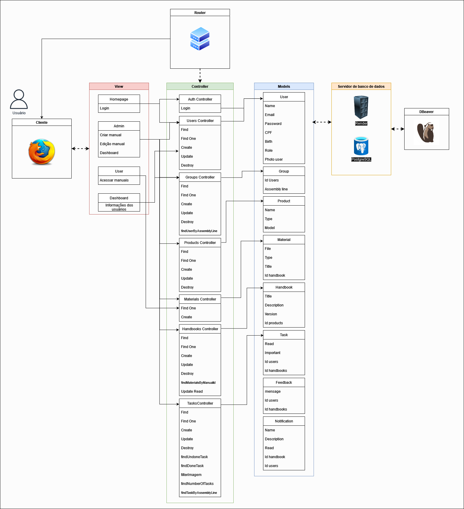
<sup> Fonte: Material produzido pelos autores (2024).</sup> </div>

&nbsp;&nbsp;&nbsp;&nbsp;No projeto em questão, será adotada a arquitetura MVC (Model-View-Controller), na qual o ``Sails.js`` será utilizado como framework _back-end_ . ``Sails.js`` é um framework MVC baseado em ``Node.js``, que é um ambiente de execução do código JavaScript do lado servidor.Esse framework facilita a construção de aplicativos web e APIs, seguindo o padrão de desenvolvimento MVC. No contexto do projeto, o ``Sails.js`` será responsável por gerenciar as camadas de _model_, _controller_ e roteamento.

&nbsp;&nbsp;&nbsp;&nbsp;No lado do cliente, as tecnologias HTML, CSS e JavaScript serão empregadas para a construção da interface do usuário (_view_). O JavaScript, tanto no cliente quanto no servidor, será utilizado para a lógica de controle (_controller_).

&nbsp;&nbsp;&nbsp;&nbsp;Além disso, o ``Sails.js`` oferece a capacidade de renderização de páginas web. No projeto, a função de renderização será utilizada para renderizar páginas HTML dinâmicas com dados provenientes do servidor. Isso permitirá a criação de páginas web dinâmicas que respondem às interações dos usuários.

&nbsp;&nbsp;&nbsp;&nbsp;No que diz respeito ao banco de dados, o PostgreSQL será utilizado para armazenar e gerenciar os dados do aplicativo. A ferramenta DBeaver será empregada para a administração do banco de dados, proporcionando uma interface amigável para consulta, visualização e manipulação dos dados armazenados.

&nbsp;&nbsp;&nbsp;&nbsp;Um exemplo prático da utilização do modelo MVC no projeto é o relacionamento entre a _view_ ``homepage`` e o _model_ ``User`` que por meio dos _controllers_ ``Auth Controller`` e ``User Controller`` permitem que o código busque no banco de dados a existência do usuário que está tentando realizar o login e direcione ele para sua correspondente página de acesso na aplicação.

&nbsp;&nbsp;&nbsp;&nbsp; Em resumo, o MVC é uma abordagem eficaz para projetar e desenvolver aplicativos web, promovendo a organização, a flexibilidade e a manutenção eficiente do código. Ao adotar o padrão MVC, os desenvolvedores podem criar aplicativos mais robustos e fáceis de manter.

## 3.2. Wireframes
&nbsp;&nbsp;&nbsp;&nbsp; Um wireframe é uma representação visual de uma página da web ou de um aplicativo, que mostra a estrutura básica e o layout dos elementos sem detalhes de design. Esta ferramenta é fundamental no processo criativo, permitindo uma visualização clara da organização e da funcionalidade de uma interface antes do desenvolvimento completo.<br>

<div align="center"> <sub> Figura 8 — Wireframe DIVE </sub>
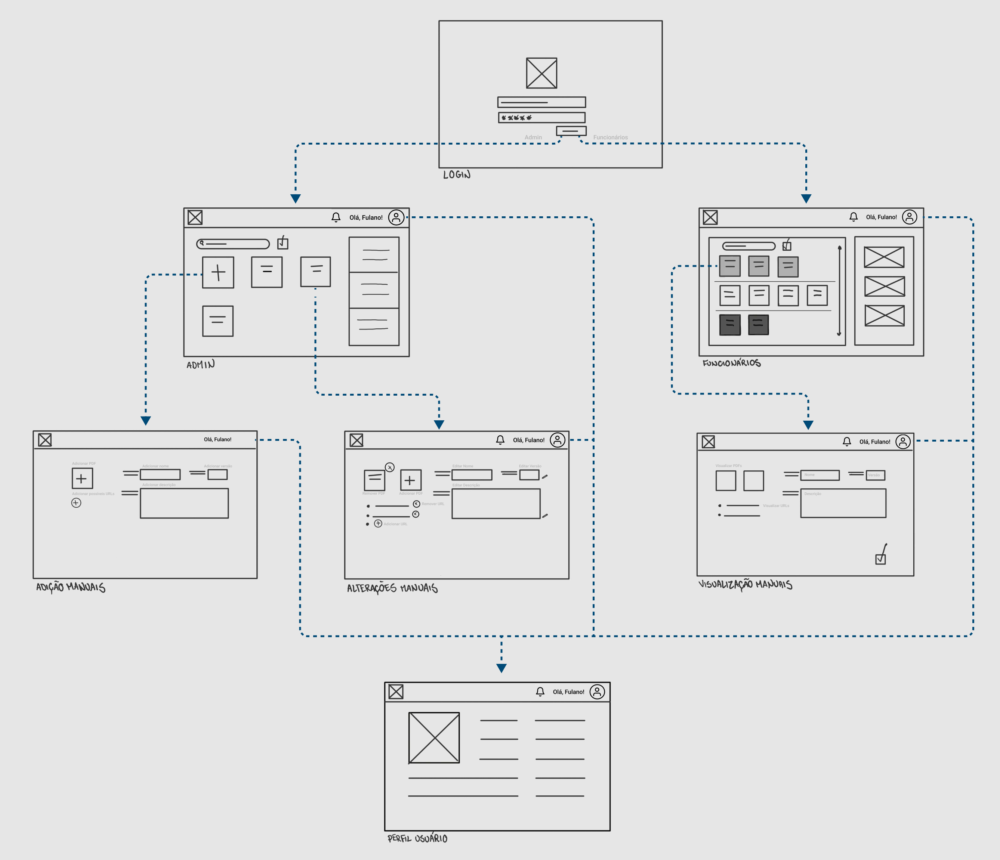
<sup>Fonte: Material produzido pelos autores (2024).</sup> </div><br>

&nbsp;&nbsp;&nbsp;&nbsp; O _wireframe_ é desenvolvido com base nas _user stories_, que refletem as necessidades dos usuários. O fluxo foi elaborado com base nas _user stories_ mencionadas na seção 2.3. O processo tem início na página de _login_, onde o usuário insere suas credenciais. Após isso, ele é direcionado para sua respectiva página, que pode ser a página de funcionário, caso seja um montador, ou a de administrador, caso seja um gestor ou engenheiro.

&nbsp;&nbsp;&nbsp;&nbsp; Na página de login, o usuário poderá entrar com suas credenciais e será redirecionado para a próxima tela que dependerá do cargo que ocupa. Para o caso de ser funcionário (montador), ele será redirecionado para a tela de funcionários, atendendo a _user story_ T001, e para o caso de ser administrador (engenheiro), ele irá para a tela de administradores, atendendo a _user story_ T007.

&nbsp;&nbsp;&nbsp;&nbsp; Ao logar na plataforma web, o funcionário terá como primeira tela a página de funcionários com a aba "A Fazer" sendo exibida como padrão, evitando a necessidade de cliques adicionais para verificar os manuais que precise estudar ou revisar. Ele terá também a oportunidade de pesquisar os manuais pelo nome ou pela categoria, em consoante com a _user story_ T002. Por fim, no cabeçalho da página, existirá um ícone em formato de sino para avisar sobre possíveis atualizações nos manuais atribuídos à ele, atendendo a _user story_ T003.

&nbsp;&nbsp;&nbsp;&nbsp; Ao clicar em um dos manuais, na tela de visualização de manuais, o funcionário tem a oportunidade de acessar seu conteúdo completo, incluindo informações como nome, data, versão e produto alvo. Isso permite que ele veja as informações detalhadas de cada manual, possibilitando uma melhor compreensão do contexto e conteúdo, conforme descrito na _user story_ T004.

&nbsp;&nbsp;&nbsp;&nbsp; Para o administrador, o processo difere. Após efetuar o login, o administrador é direcionado a uma página que exibe uma lista de manuais, juntamente com alguns dados gerais sobre o desempenho da plataforma. Esses dados são estatísticas de leitura e visualização dos manuais, atendendo às necessidades descritas na _user story_ T006. Essas informações permitem que o administrador compreenda o engajamento geral dos usuários e identifique áreas de foco para melhorias ou atualizações de conteúdo, atendendo a vontade do usuário administrador desenvolvido.

&nbsp;&nbsp;&nbsp;&nbsp; Além disso, na lista de manuais, o administrador tem a possibilidade de realizar o gerenciamento de manuais existentes, bem como adicionar novos manuais utilizando o botão de adição. Adicionalmente, o administrador pode atribuir diferentes manuais a usuários específicos. Esse procedimento atende à necessidade descrita na _user story_ T005, permitindo o gerenciamento eficiente do desenvolvimento e treinamento.

&nbsp;&nbsp;&nbsp;&nbsp;A elaboração dos wireframes, baseada nas histórias de usuário e no fluxo de interação, permitiu o desenvolvimento de interfaces distintas para os funcionários e administradores. Esses wireframes fornecem uma representação visual clara da estrutura e do layout das páginas, garantindo que as necessidades específicas de cada tipo de usuário sejam atendidas de forma eficiente.

## 3.3. Guia de estilos

&nbsp;&nbsp;&nbsp;&nbsp;O Guia de Estilos é um documento que estabelece as diretrizes de design de uma empresa ou projeto. Isso é, ele é responsável por definir os parâmetros de design que serão seguidos de maneira consistente durante todo o projeto. Seu uso visa garantir que todas as interfaces e elementos sigam o mesmo padrão, desenvolvendo uma aplicação com uma identidade visual coesa e congruente.[⁴](#c7)

&nbsp;&nbsp;&nbsp;&nbsp;Para a aplicação web que estamos desenvolvendo, tomamos como base o guia de estilo fornecido pela própria _Dell Technologies_, chamado de _Dell Design System_ (DDS)[⁵](#c7). Com isso, além das vantagens citadas anteriormente, também asseguramos um design desenvolvido seguindo critérios de acessibilidade, inclusão e usabilidade.

&nbsp;&nbsp;&nbsp;&nbsp;Vale destacar que o DDS contém também componentes reutilizáveis criados em uma base de padrões única, como cor, tipografia, espaçamento, entre outros. Além disso, todos os componentes são acompanhados de diretrizes e documentação com padrões de uso e boas práticas.

&nbsp;&nbsp;&nbsp;&nbsp;Por fim, foi desenvolvido um guia de estilo próprio na plataforma Figma para o projeto, presente em [Anexos](#c8), contendo elementos selecionados, seguindo as orientações do DDS. Ele pode ser visualizado clicando [aqui](https://www.figma.com/design/giDrQB6kTdwC4R8gZ0dlWy/G3-M2?node-id=358%3A24&t=1tdHlR7XYSWoIL4H-1).

### 3.3.1 Cores

&nbsp;&nbsp;&nbsp;&nbsp;O DDS define que "o uso da cor em uma experiência ajuda a definir a comunicação, o significado, a marca e os papéis, facilitando a interação, a busca e a diferenciação dos elementos pelos usuários"[⁵](#c7). Desse modo, utilizamos as cores de acordo com suas recomendações.

<div align="center"> <sub> Figura 9 — Paleta de Cores </sub><br>
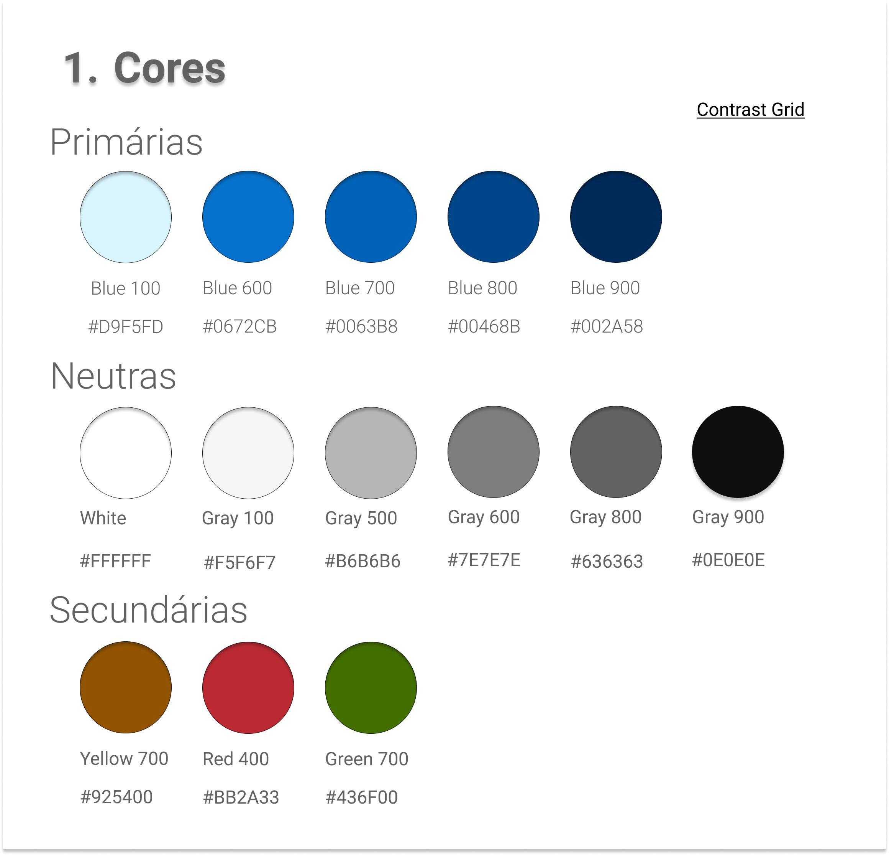<br>
<sup>Fonte: Material produzido pelos autores (2024).</sup> </div>

&nbsp;&nbsp;&nbsp;&nbsp;A paleta de cores primárias é composta por vários tons de azul que reforçam a marca, em especial o Azul 600 (``#0672CB``), que é a cor básica de vários elementos da interface de usuário.

&nbsp;&nbsp;&nbsp;&nbsp;A paleta de cores neutras é composta de cinza e ardósia e pode ser utilizada para fundos, elementos de contraste e efeitos de elevação e profundidade.

&nbsp;&nbsp;&nbsp;&nbsp;A paleta de cores secundárias é composta por uma vasta gama de cores, indo do violeta ao vermelho e visa ajudar os usuários a encontrar orientação, identificar status, compreender ações e localizar ajuda. Entretanto, é recomendado que os _designers_ utilizem sempre texto e/ou ícones para ajudar a esclarecer o contexto para usuários daltônicos e para aqueles que dependem de tecnologia assistiva.

&nbsp;&nbsp;&nbsp;&nbsp;Vale destacar que as cores secundárias incluem cores de _feedback_ universalmente reconhecidas e seus significados, como por exemplo: azul indicando informação; amarelo indicando aviso; vermelho indicando erro; e verde indicando sucesso.

&nbsp;&nbsp;&nbsp;&nbsp;Um útimo comentário sobre a paleta de cores recomendadas pelo DDS é sobre o contraste entre texto e fundo. Com um grande foco em acessibilidade, a _Dell Technologies_ recomenda o uso de ferramentas para validar o uso de certas cores na criação de um design, como o _Contrast Grid_[⁶](#c7). Para a presente aplicação web, as cores usadas seguem um nível mínimo AA segundo as Diretrizes de Acessibilidade para Conteúdo _Web_ (WCAG) 2.0[⁷](#c7) e é possivel acessar o _Contrast Grid_ criado pelo seguinte [link](https://contrast-grid.eightshapes.com/?version=1.1.0&background-colors=&foreground-colors=%23FFFFFF%2C%20White%0D%0A%23F0F0F0%2C%20Gray%20100%0D%0A%23B6B6B6%2C%20Gray%20500%0D%0A%237E7E7E%2C%20Gray%20600%0D%0A%23636363%2C%20Gray%20800%0D%0A%230E0E0E%2C%20Gray%20900%0D%0A%23D9F5FD%2C%20Blue%20100%0D%0A%230672CB%2C%20Blue%20600%0D%0A%230063B8%2C%20Blue%20700%0D%0A%2300468B%2C%20Blue%20800%0D%0A%23002A58%2C%20Blue%20900%0D%0A%231D2C3B%2C%20Slate%20700%0D%0A%23CE8D00%2C%20Yellow%20400%0D%0A%23FE6873%2C%20Red%20400%0D%0A%237AA809%2C%20Green%20400%0D%0A&es-color-form__tile-size=regular&es-color-form__show-contrast=aaa&es-color-form__show-contrast=aa).

&nbsp;&nbsp;&nbsp;&nbsp;A tabela de cores utilizadas e seu código pode ser vista a seguir:

<div align="center">
    <sub> Tabela 9: Paleta de Cores</sub>
</div>

| # | Nome da cor | Código hex |
|---|-------------|------------|
| 1 | White       | #FFFFFF    |
| 2 | Gray 100    | #F0F0F0    |
| 3 | Gray 500    | #B6B6B6    |
| 4 | Gray 600    | #7E7E7E    |
| 5 | Gray 800    | #636363    |
| 6 | Gray 900    | #0E0E0E    |
| 7 | Blue 100    | #D9F5FD    |
| 8 | Blue 600    | #0672CB    |
| 9 | Blue 700    | #0063B8    |
|10 | Blue 800    | #00468B    |
|11 | Blue 900    | #002A58    |
|12 | Slate 700   | #1D2C3B    |
|13 | Yellow 700  | #925400    |
|14 | Red 700     | #BB2433    |
|15 | Green 700   | #436F00    |

<div align="center">
    <sup> Fonte: Material produzido pelos autores (2024)</sup>
</div>

&nbsp;&nbsp;&nbsp;&nbsp;Em resumo, ao seguir as recomendações do DDS em relação à paleta de cores, garantimos não apenas uma identidade visual coesa, mas também facilitamos a comunicação e a usabilidade da interface. A escolha cuidadosa das cores fortalece a marca e auxilia os usuários na navegação do sistema. Ainda, priorizar a acessibilidade, conforme sugerido pela _Dell Technologies_, assegura que nossa aplicação web seja inclusiva e amigável para todos os usuários.

### 3.3.2 Tipografia

&nbsp;&nbsp;&nbsp;&nbsp;A tipografia é um sistema de letras, números e caracteres. Uma boa tipografia garante legibilidade, estética limpa e uma hierarquia de informações bem definida.[⁵](#c7)

&nbsp;&nbsp;&nbsp;&nbsp;Para a aplicação _web_ DIVE, escolhemos a fonte Roboto, tomando como base o DDS. Foram selecionadas diversas configurações de letras também para customizar melhor o projeto. Vale destacar aqui que também existem padrões para espaçamento entre tamanhos de _header_ e _body_ que não foram listados nos materiais a seguir, mas foram aplicados ao protótipo de alta fidelidade (seção 3.4).

&nbsp;&nbsp;&nbsp;&nbsp;A tabela a seguir apresenta a tipografia atual do projeto e pode sofrer alterações caso seja necessário adicionar algum estilo extra.

<div align="center">
    <sub> Tabela 10: Tipografia</sub>
</div>

| Especificações | Estilo | Uso |
|-----------------|--------|-----|
| Size: 48px / 3rem Line-height: 56px Weight: 300 Light | Header 1 | O maior tamanho de fonte, usada para layouts de página |
| Size: 40px / 2.5rem Line-height: 48px Weight: 300 Light | Header 2 | Usada para layouts de página |
| Size: 32px / 2rem Line-height: 40px Weight: 300 Light | Header 3 |  Usada para layouts de página ou abaixo de cabeçalhos |
| Size: 24px / 1.5rem Line-height: 32px Weight: 400 Regular | Header 4 | Geralmente usada abaixo de cabeçalhos |
| Size: 24px /1.5rem Line-height: 36px Weight: 300 Light | Body 1 | Usada em grandes blocos de texto usados para citações ou para destacar parte do texto |
| Size: 16px / 1rem Line-height: 24px Weight: 400 Regular | Body 2 | Tamanho padrão, deve ser usada na maioria dos textos |
| Size: 16px / 1rem Line-height: 24px Weight: 500 Medium | Button 1 | Texto padrão de botões |
| Size: 12px / 0.75rem Line-height: 20px Weight: 400 Regular | Caption | Texto de validação ou de ajuda para campos de formulários |

<div align="center">
    <sup> Fonte: Material produzido pelos autores (2024)</sup>
</div>

&nbsp;&nbsp;&nbsp;&nbsp;Vale destacar que a tipografia, baseada no DDS, segue padrões de acessibilidade também e deve ser utilizada seguindo uma ordem lógica hierárquica. Um exemplo de acessibilidade é a utilização de cores de texto seguindo os padrões de nível AA das WCAG 2.0 com fundos claros e pode ser vista na figura a seguir:

<div align="center"><sub> Figura 10 — Cores de texto padrão  para fundos claros </sub><br>
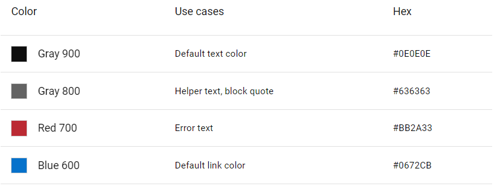<br>
<sup>Fonte: Dell Design System</sup> </div>

&nbsp;&nbsp;&nbsp;&nbsp;Em resumo, a escolha cuidadosa da tipografia, como a fonte Roboto, e a personalização detalhada dos estilos no projeto DIVE visam criar não apenas uma estética atraente, mas também uma comunicação clara e acessível. Seguindo padrões de legibilidade e acessibilidade, nossa abordagem objetiva transmitir também uma experiência de usuário inclusiva e eficaz.

### 3.3.3 Iconografia e imagens

&nbsp;&nbsp;&nbsp;&nbsp;Ícones representam itens e ideias através de um formato gráfico simples e direto. Eles auxiliam a comunicação com um padrão universal.[⁵](#c7)

&nbsp;&nbsp;&nbsp;&nbsp;Os ícones usados na aplicação web DIVE podem ser visualizados na imagem abaixo e estão no formato _Scalable Vector Graphics_ (SVG). Também seguem o padrão _monoline_, traço sem preenchimento, como estilo para auxiliar visualmente seu entendimento (exceto os ícones de coração e estrela com preenchimento total).

<div align="center"> <sub> Figura 11 — Iconografia </sub><br>
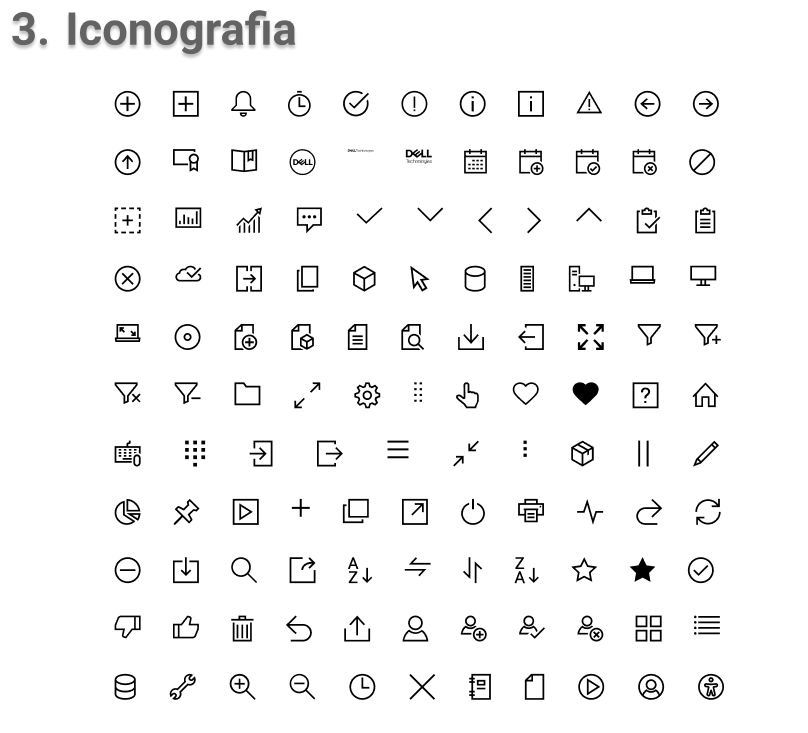<br>
<sup>Fonte: Dell Design System</sup> </div>

&nbsp;&nbsp;&nbsp;&nbsp;Os padrões de acessibilidade também devem ser seguidos ao utilizar ícones no design e é recomendado: utilizar descrições escritas dos ícones sempre que possível, caso contrário, adicionar uma texto alternativo que descreva o significado do ícone; utilizar uma largura do traço de contorno do ícone que respeite a taxa de contraste adequada; e escolher ícones que sejam universalmente reconhecíveis. Todos esses padrões podem ser verificados nas Diretrizes de Acessibilidade para Conteúdo _Web_ (WCAG) 2.1.[⁸](#c7). A seguir, listamos os ícones utilizados nas páginas do protótipo da aplicação e sua explicação sobre quando utilizá-los.

<div align="center">
    <sub> Tabela 11: Iconografia</sub>
</div>

| Ícone                                                 | Descrição                                       |
|-------------------------------------------------------|-------------------------------------------------|
|                          | Indica som ou áudio.                            |
|          | Símbolo de alarme ou notificação.               |
|              | Ícone de calendário para eventos ou datas.      |
|                  | Representa imagem ou figura.                    |
|  | Indica que algo pode ser expandido para baixo.  |
|      | Indica que algo pode ser recolhido para cima.   |
| | Símbolo de uma prancheta com linhas de texto.   |
|                    | Representa um relógio ou tempo.                 |
|                | Ícone para fechar ou cancelar.                  |
|                        | Representa um cubo tridimensional ou arquivo 3D.|
|         | Símbolo de um computador de mesa.               |
|           | Ícone de um laptop.                             |
|          | Representa um manual ou documento de instrução. |
|              | Ícone de um documento ou arquivo.               |
| | Logotipo da empresa Dell.               |
|              | Botão de reprodução, geralmente para mídia.     |
|              | Ícone de adição ou incremento.                  |
|           | Representa um servidor.                         |
|                        | Símbolo de etiqueta ou tag.                     |
|              | Ícone de um usuário em um círculo.              |
|      | Adição de um novo usuário.                      |
|                    | Representa vídeo ou gravação.                   |


<div align="center">
    <sup> Fonte: Material produzido pelos autores (2024)</sup>
</div>

&nbsp;&nbsp;&nbsp;&nbsp;Existem dois ícones representando o logo da _Dell Technologies_. Para nossa aplicação web estamos estudando o desenvolvendo de uma logo do projeto, caso contrário, usaremos a logo da própria _Dell_, como a representada abaixo:

<div align="center"> <sub> Figura 12 — Logo da Dell </sub><br>
<br>
<sup>Fonte: Dell Design System</sup> </div>

### 3.3.4 Buttons

&nbsp;&nbsp;&nbsp;&nbsp;Os botões em uma aplicação web são elementos interativos que os usuários podem clicar para realizar ações específicas, como enviar um formulário, acessar uma página, fazer uma compra ou iniciar uma funcionalidade. Eles são uma parte essencial da interface de usuário, pois fornecem _feedback_ visual e tátil, indicando claramente onde os usuários podem interagir.

&nbsp;&nbsp;&nbsp;&nbsp;No projeto DIVE, os botões desempenham uma função crucial ao concluir ações, como realizar o login ou finalizar a criação de um manual. Eles são projetados com três estados distintos, cada um com sua própria cor de destaque: o estado normal (_rest_) é representado pela cor Blue 600, o estado de destaque (_hover_) pela cor Blue 700 e o estado de clique (_press_) pela cor Blue 800. Esses estados correspondem, respectivamente, aos momentos em que o botão não está sendo interagido, quando o usuário passa o mouse sobre ele e quando ele é acionado por meio de um clique.

&nbsp;&nbsp;&nbsp;&nbsp;Além disso a aplicação possui 3 tamanhos distintos de botões, sendo eles pequenos, médios e grandes. Tudo que foi descrito pode ser visto na imagem abaixo:

<div align="center"> <sub> Figura 13 — Botões </sub><br>
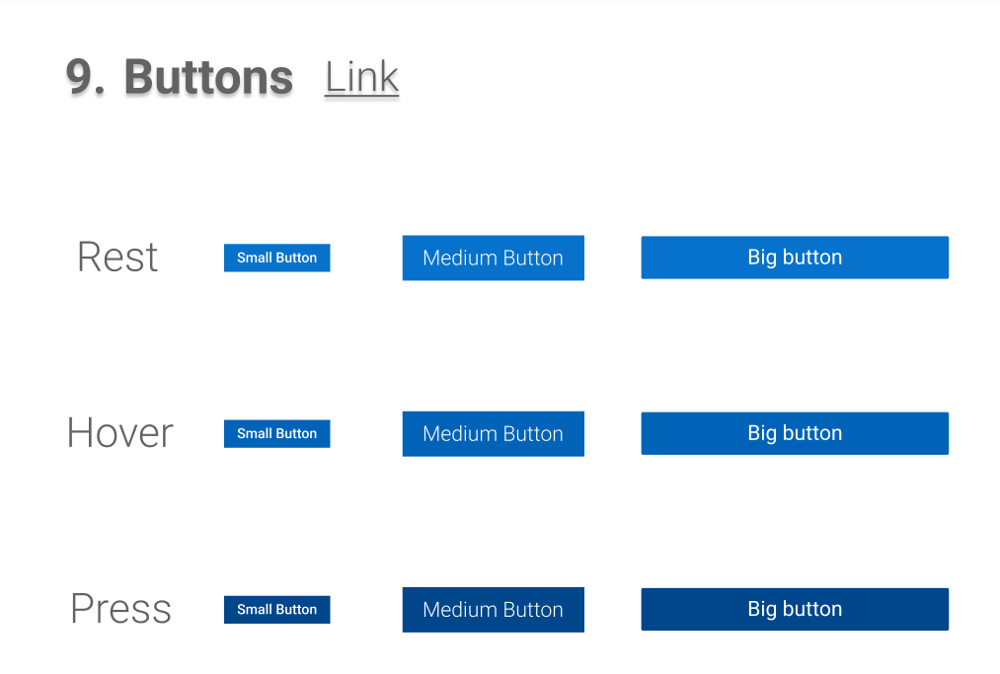<br>
<sup>Fonte: Material produzido pelos autores (2024).</sup> </div> <br>

&nbsp;&nbsp;&nbsp;&nbsp;Outro detalhe que deve ser mencionado sobre os botões é sua cor principal. O DDS define vários sentidos que deseja-se alcançar ao usar uma cor específica para cada botão. O ``azul 600`` busca manter a imagem da marca e é usado para envios de formulários e para a maioria das *call-backs*. O ``vermelho 600`` é referenciado como *Destructive button* e sinaliza alarme, sendo utilizado para quando o usuário está prestes a realizar uma ação que removerá conteúdo ou resultará em perda de dados que não pode ser revertida. O ``verde 600`` é usado para botões transacionais, que executam uma escolha ou decisão relacionada a dinheiro ou compra. Finalmente, o botão editorial que pode ser das cores ``cinza 900`` ou ``branco`` e são utilizados junto com gráficos e fundos em que o contraste possa apresentar problemas.

&nbsp;&nbsp;&nbsp;&nbsp;Os botões em uma aplicação _web_ desempenham um papel fundamental, proporcionando uma interface intuitiva e tátil para os usuários. Sua importância reside na facilidade de uso que oferecem, permitindo que os usuários concluam ações de forma rápida e eficiente. Além disso, a tactibilidade dos botões, ou seja, sua capacidade de fornecer feedback visual e tátil quando interagidos, aumenta a usabilidade da aplicação, tornando-a mais acessível e amigável. Em última análise, os botões são elementos essenciais que contribuem significativamente para uma experiência de usuário positiva e satisfatória em uma aplicação _web_.

## 3.4 Protótipo de alta fidelidade

&nbsp;&nbsp;&nbsp;&nbsp; Durante o processo de desenvolvimento de aplicações _web_, é essencial a produção do protótipo de alta fidelidade, isto é, uma representação de como será a interface do produto final. Logo, o recurso conta com todas as utilidades desejadas, incluindo botões interativos que levarão às telas planejadas durante o wireframe de baixa fidelidade. Para isso, é considerado o guia de estilo, o qual define com rigor as regras de design que devem ser seguidas.

&nbsp;&nbsp;&nbsp;&nbsp; Dentre as diversas regras de espaçamento presentes no DDS, vale destacar duas que balizaram todo o desenvolvimento do protótipo de alta fidelidade: uma base de _grid_ de 4 _pixels_, sendo que o espaço recomendado que entre cada elemento seja um múltiplo dela, horizontal e verticalmente, combinada com um sistema de 12 colunas, para deixar o design responsivo e adaptável para diversos formatos de telas.

&nbsp;&nbsp;&nbsp;&nbsp; Nesse contexto, foram desenvolvidas dez telas, devididas entre a visualização do administrador e do membro. A seguir está a a página de login, que será comum às duas classificações de funcionários.

<div align="center"> <sub> Figura 14 — Tela de Login </sub>
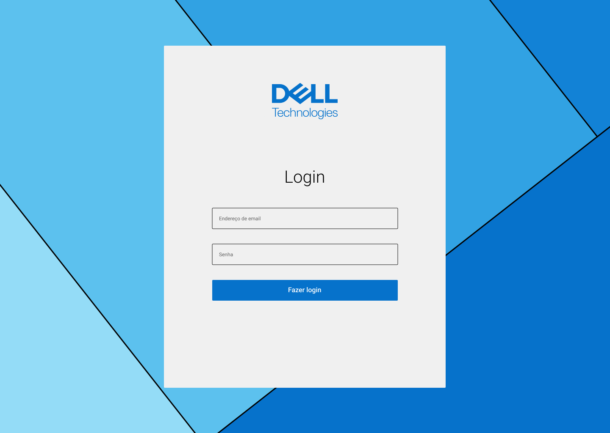
<sup>Fonte: Material produzido pelos autores (2024).</sup> </div> <br>

&nbsp;&nbsp;&nbsp;&nbsp; Caso o funcionário seja um administrador, ele deverá preencher os campos solicitados e clicar no botão "Fazer Login", seguindo o fluxo iniciado pela _user story_ T007. Assim, como previsto na _user story_ T006, o engenheiro será direcionado para uma tela em que haverá um mini dashboard, isto é, um conjunto de estatísticas sobre o desempenho dos montadores quanto à leitura dos manuais, que permitirá um melhor controle das linhas. Mais abaixo, como apontado na _user story_ T005, o administrador poderá acessar os manuais já publicados, que terão a opção de serem editados, ou adicionar um novo, como pode ser visto abaixo:

<div align="center"> <sub> Figura 15 — Tela Inicial de Administrador </sub>

<sup>Fonte: Material produzido pelos autores (2024).</sup> </div> <br>

&nbsp;&nbsp;&nbsp;&nbsp; Ao clicar na opção com o símbolo "+" representado, o engenheiro poderá adicionar uma manual, bem como descrito na user story T005. A seguir é apresentada a tela em questão:

<div align="center"> <sub> Figura 16 — Adicionar Manual </sub>

<sup>Fonte: Material produzido pelos autores (2024).</sup> </div> <br>

&nbsp;&nbsp;&nbsp;&nbsp; Caso o usuário siga outro caminho e, na tela inicial, clique em algum manual, poderá editá-lo, como mostrado abaixo:

<div align="center"> <sub> Figura 17 — Editar Manual </sub>

<sup>Fonte: Material produzido pelos autores (2024).</sup> </div> <br>

&nbsp;&nbsp;&nbsp;&nbsp; Na página inicial, haverá também a opção de visulizar o perfil do funcionário, opção disponível para ambos os cargos. Como será apresentado, essa área irá informar as informações pessoais do trabalhador:

<div align="center"> <sub> Figura 18 — Tela de Perfil </sub>

<sup>Fonte: Material produzido pelos autores (2024).</sup> </div> <br>

&nbsp;&nbsp;&nbsp;&nbsp; Agora, será exibida as possíveis ações do membro. Ao fazer login na mesma página do administrador, o montador será logo direcinado à tela inicial, como descrito na _user story_ T001, onde poderá ver se há alguma notificação por meio do ícone de sino no canto superior direito da tela, de forma que corresponda à ação descrita na _user story_ T003, e acessar facilmente sua lista de manuais pendentes:

<div align="center"> <sub> Figura 19 — Área de a Fazer do Membro </sub>

<sup>Fonte: Material produzido pelos autores (2024).</sup> </div> <br>

&nbsp;&nbsp;&nbsp;&nbsp; Assim, seguindo a ideia sugerida na _user story_ T002, a partir da barra de navegação no topo da página, o usuário poderá acessar a área com seus manuais lidos, ou até com todos o manuais já publicados:

<div align="center"> <sub> Figura 20 — Área de Feito do Membro </sub>

<sup>Fonte: Material produzido pelos autores (2024).</sup> </div> <br>

<div align="center"> <sub> Figura 21 — Área do Membro com Todos os Manuais </sub>

<sup>Fonte: Material produzido pelos autores (2024).</sup> </div> <br>

&nbsp;&nbsp;&nbsp;&nbsp; Ao acessar qualquer manual, o membro poderá visualizar seu conteúdo, como os arquivos associadados, e seus metadados, como sugerido na _user story_ T004, além de poder revisar as versões anteriores do manual e reportar um erro:

<div align="center"> <sub> Figura 22 — Visualização do Manual pelo Membro </sub>

<sup>Fonte: Material produzido pelos autores (2024).</sup> </div> <br>

<div align="center"> <sub> Figura 23 — Acessar Versões Anteriores do Manual </sub>

<sup>Fonte: Material produzido pelos autores (2024).</sup> </div> <br>

<div align="center"> <sub> Figura 24 — Reportar um Erro no Manual </sub>

<sup>Fonte: Material produzido pelos autores (2024).</sup> </div> <br>

&nbsp;&nbsp;&nbsp;&nbsp; Nesse contexto, a criação do protótipo de alta fidelidade colabora para o desenvolvimento do projeto, uma vez que ajuda a equipe na organização e visualização mais fácil das etapas necessárias para a elaboração da aplicação web. Além disso, o planejamento das telas evita possíveis erros e proporciona uma produção mais rápida.

## 3.5. Modelagem do banco de dados

### 3.5.1. Modelo relacional

&nbsp;&nbsp;&nbsp;&nbsp;Um modelo relacional de banco de dados conta com uma organização em tabelas, linhas e colunas, cada uma das seções representando informações diferentes que se complementam. Nesse contexto, cada tabela é reconhecida como uma entidade, isto é, um conjunto de dados sobre certo conceito, como usuários e manuais. Elas são divididas em colunas, ou atributos, as quais definem os dados que serão em armazenados a cada novo registro. Por fim, há as linhas, que correspondem a elementos como um novo usuário cadastrado.

&nbsp;&nbsp;&nbsp;&nbsp;Entretanto, para o modelo ser de fato relacional, é necessário a presença de chaves estrangeiras, ou seja, colunas em comum entre tabelas. Para isso, precisa haver o atributo id (ou código) em cada entidade, o qual será uma chave primária dentro de sua própria tabela e chave estrangeira quando copiada para outra. Cada id será um número inteiro único maior do que zero, que deve crescer conforme a adição de novas linhas em uma tabela.

&nbsp;&nbsp;&nbsp;&nbsp;Nesse contexto, foi modelado um banco de dados para a aplicação web, conforme exibido abaixo:

<div align="center"> <sub> Figura 25 — Modelo Relacional DIVE </sub>
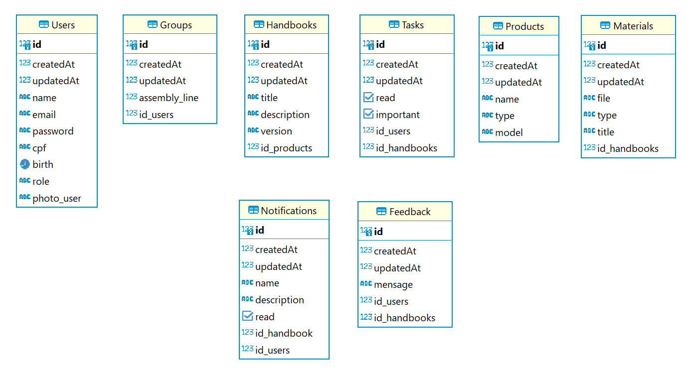
<sub>Fonte: Material produzido pelos autores (2024).</sub> </div><br>

&nbsp;&nbsp;&nbsp;&nbsp;Como é possível notar, o modelo relacional conta com sete tabelas, sendo apenas três consideradas independentes, ou seja, não possuem chaves estrangeiras entre seus atributos, sendo elas: "users", "products" e "materials".

&nbsp;&nbsp;&nbsp;&nbsp;Além das entidades já mencionadas, há outras quatro essenciais para as funcionalidades disponíveis na plataforma DIVE. A imagem em questão ilustra as relações entre cada tabela por meio de conexões estabelecidas por chaves estrangeiras. Para uma compreensão mais aprofundada dos relacionamentos e da aplicabilidade de cada tabela, segue-se uma explicação detalhada das entidades e de seus respectivos relacionamentos.

#### Entidades e seus relacionamentos:

&nbsp;&nbsp;&nbsp;&nbsp;A tabela "_users_" tem como finalidade armazenar informações dos usuários, tais como seus nomes, endereços de email, senhas, CPFs, datas de nascimento, cargos e suas respectivas fotos de perfil. Esta tabela utiliza o atributo "id_users" como chave primária. Além disso, estabelece relações com as tabelas "_groups_", "_tasks_" e "_feedbacks_". As três relações são do tipo N:1, ou seja, um usuário pode ter várias tarefas e feedbacks atribuídas a ele e vários usuários podem ter o mesmo cargo.

&nbsp;&nbsp;&nbsp;&nbsp;A tabela "_groups_" descreve e armazena informações relacionadas às linhas de produção de uma empresa. Seu _design_ inclui uma chave primária denominada "id", que funciona como um identificador exclusivo para cada registro, representando uma pessoa na linha de produção. Além disso, a tabela "_groups_" contém um atributo chamado "id_users", que atua como uma chave estrangeira, referenciando o identificador dos usuários na tabela "_users_". Um atributo adicional presente na tabela "_groups_" é "_assembly line_", que identifica a linha de produção à qual cada usuário está associado. Assim, essa tabela atribui a cada usuário específico a sua respectiva linha de produção, permitindo a alocação de tarefas de forma individual ou por linha de produção. Dessa forma, a tabela "_groups_" desempenha um papel fundamental na organização da produção, contribuindo assim para o controle e eficiência da produção na empresa.

&nbsp;&nbsp;&nbsp;&nbsp;Para garantir a usabilidade da aplicação, é necessário estabelecer uma relação entre as tabelas "_handbooks_" e "_users_", a fim de direcionar os manuais individualmente para os usuários. Essa relação possui uma cardinalidade N:N, indicando que um manual pode ser atribuído a vários usuários e um usuário pode ter vários manuais atribuídos a ele. Para resolver essa cardinalidade, foi criada a tabela associativa "_tasks_". Esta tabela funciona como uma ponte entre as tabelas "_users_" e "_handbooks_", permitindo a alocação e atribuição de manuais para usuários específicos ou por linha de produção, por meio de uma busca no banco de dados. Além disso, irá guardar dois dados booleanos: "_read_" e "_important_", que definirão se o montador já leu o manual e se ele será mostrado como importante. Assim, cada registro na tabela "_tasks_" associa um manual a um usuário, garantindo a eficiência na distribuição de manuais dentro da aplicação. A estrutura da tabela "_tasks_" provê um meio de gerenciar as atribuições de manuais para grupos de usuários ou individualmente de forma eficiente, facilitando o controle e a organização do processo de distribuição de manuais na aplicação.

&nbsp;&nbsp;&nbsp;&nbsp;A tabela "_handbooks_" armazena informações sobre os manuais dos produtos da DELL. Essa tabela é formada por dados obtidos das tabelas "_products_" e utiliza a chave estrangeiras "_id product_". Isso estabelece uma relação entre essas entidades. A cardinalidade entre as tabelas "_handbooks_" e "_products_" é de 1:1, o que significa que um manual está associado a apenas um produto e um produto possui apenas um manual. Por outro lado, existe a relação entre as tabelas "_handbooks_" e "_materials_", que é representada pela chave estrangeira "_id handbooks_" presente na tabela "_materials_", essa relação possui uma cardinalidade de 1:N, indicando que vários arquivos podem estar associados a um único manual. Cada manual é formado pelos arquivos associados, provenientes da tabela "_materials_", e pelo produto correspondente, que vem da tabela "_products_". Além disso, os manuais possuem informações complementares, como os atributos "_title_", "_description_" e "_version_", que são fornecidos pela própria tabela "_handbooks_".

&nbsp;&nbsp;&nbsp;&nbsp;Já a entidade "_feedbacks_", será responsável por conter os pontos de melhoria de cada manual apontados pelos montadores. Para isso, foi aplicado o atributo "_mensage_", que armazenará os textos enviados, e as chaves estrangeiras "_id users_" e "_id handbooks_", as quais garantem a associação entre as mensagens, o manual em questão e quem enviou. Assim, todas as relações que envolvem a tabela "_feedbacks_" consistem em relações N:1.

&nbsp;&nbsp;&nbsp;&nbsp;Há também a tabela "_Notifications_", a qual contém as infromações necessárias para gerar notificações para os montadores sobre a atualização dos manuais. Ela conta com as colunas: "_name_", sendo o título da notificação; "_description_", representando o que foi modificado no manual; "_read_", para marcar se o montador leu; e as chaves estrangeiras "_id users_" e "_id handbooks_", relacionando a tabela em questão com as tabelas "_Users_" e "_Handbooks_"

&nbsp;&nbsp;&nbsp;&nbsp;Por fim, as tabelas "_materials_" e "_products_" armazenam dados e informações complementares aos manuais. A tabela "_materials_" é responsável pelo armazenamento dos arquivos multimídia dos manuais, como PDFs, vídeos, áudios, e outros tipos de documentos necessários para uma compreensão completa do montador. Por sua vez, a tabela "_products_" lista os produtos montados pela Dell, relacionando-os com seus respectivos manuais na tabela "_handbooks_" através da chave primária "id". Essa chave "id" registra cada produto individualmente, permitindo essa associação entre os manuais e os produtos de forma precisa e organizada.

&nbsp;&nbsp;&nbsp;&nbsp;Além disso, todas as tabelas apresentam os atributos "created_at" e "updated_at", que irão mostrar quando a linhas foi criada ou alterada, respectivamente.

 #### Integração do Modelo Físico

&nbsp;&nbsp;&nbsp;&nbsp;O código SQL (_Structured Query Language_) é fundamental para a criação e gestão de bancos de dados, pois através de seus comandos é possível criar tabelas, definir chaves primárias e estrangeiras, e estabelecer relacionamentos entre diferentes entidades, refletindo o modelo físico do banco de dados. O modelo físico é a representação detalhada de como os dados serão armazenados no sistema, incluindo estruturas de armazenamento. O SQL traduz o modelo lógico, que é mais abstrato, em um modelo físico executável, garantindo que o banco de dados seja implementado de acordo com os requisitos de integridade e consistência estabelecidos na fase de _design_. Assim, o SQL é essencial não apenas para a construção inicial do banco de dados, mas também para a sua manutenção e evolução ao longo do tempo.

```sql
-- Cria a tabela Users (usuários)
CREATE TABLE Users (
 id SERIAL PRIMARY KEY,
 created_at INTEGER,
 updated_at INTEGER,
 name VARCHAR(60) NOT NULL DEFAULT 'NULL',
 email VARCHAR(50) NOT NULL DEFAULT 'NULL',
 password VARCHAR(30) NOT NULL DEFAULT 'NULL',
 cpf BIGINT NOT NULL,
 birth DATE,
 role VARCHAR(30) NOT NULL DEFAULT 'NULL',
 photo_user VARCHAR
);

-- Cria a tabela Groups (linhas de produção)
CREATE TABLE Groups (
 id SERIAL PRIMARY KEY,
 created_at INTEGER,
 updated_at INTEGER,
 assembly_line INTEGER NOT NULL,
 id_users INTEGER
);

-- Cria a tabela Tasks (tarefas)
CREATE TABLE Tasks (
 id SERIAL PRIMARY KEY,
 created_at INTEGER,
 updated_at INTEGER,
 read BOOLEAN NOT NULL,
 important BOOLEAN NOT NULL,
 id_users INTEGER,
 id_handbooks INTEGER
);

-- Cria a tabela Handbooks (manuais)
CREATE TABLE Handbooks (
 id SERIAL PRIMARY KEY,
 created_at INTEGER NOT NULL,
 updated_at INTEGER NOT NULL,
 title VARCHAR NOT NULL DEFAULT 'NULL'
 description VARCHAR NOT NULL DEFAULT 'NULL',
 version VARCHAR NOT NULL DEFAULT 'NULL',
 id_products INTEGER
);

-- Cria a tabela Materials (arquivos)
CREATE TABLE Materials (
 id SERIAL PRIMARY KEY,
 created_at INTEGER,
 updated_at INTEGER,
 file VARCHAR NOT NULL DEFAULT 'NULL',
 type VARCHAR NOT NULL DEFAULT 'NULL',
 title VARCHAR(60) NOT NULL DEFAULT 'NULL'
 id_materials INTEGER,
);

-- Cria a tabela Products (produtos)
CREATE TABLE Products (
 id SERIAL PRIMARY KEY,
 created_at INTEGER,
 updated_at INTEGER,
 name VARCHAR(50) NOT NULL DEFAULT 'NULL',
 type VARCHAR(30) NOT NULL DEFAULT 'NULL',
 model VARCHAR(40) NOT NULL DEFAULT 'NULL'
);

-- Cria a tabela Feedbacks (reporte de erros)
CREATE TABLE Feedbacks (
 id SERIAL PRIMARY KEY,
 created_at INTEGER,
 updated_at INTEGER,
 mensage VARCHAR NOT NULL DEFAULT 'NULL',
 id_users INTEGER,
 id_handbooks INTEGER
);

-- Cria a tabela Notifications (notificações)
CREATE TABLE Notifications (
 id SERIAL PRIMARY KEY,
 created_at  INTEGER,
 updated_at INTEGER,
 name VARCHAR,
 description VARCHAR,
 read BOOLEAN,
 id_users INTEGER,
 id_handbooks INTEGER
);

-- Cria as chaves estrangeiras
ALTER TABLE Groups ADD CONSTRAINT Groups_id_users_fkey FOREIGN KEY (id_users) REFERENCES Users(id);
ALTER TABLE Tasks ADD CONSTRAINT Tasks_id_users_fkey FOREIGN KEY (id_users) REFERENCES Users(id);
ALTER TABLE Tasks ADD CONSTRAINT Tasks_id_handbooks_fkey FOREIGN KEY (id_handbooks) REFERENCES Handbooks(id);
ALTER TABLE Handbooks ADD CONSTRAINT Handbooks_id_products_fkey FOREIGN KEY (id_products) REFERENCES Products(id);
ALTER TABLE Materials ADD CONSTRAINT Materials_id_handbooks_fkey FOREIGN KEY (id_handbooks) REFERENCES Handbooks(id);
ALTER TABLE Feedbacks ADD CONSTRAINT Feedbacks_id_users_fkey FOREIGN KEY (id_users) REFERENCES Users(id);
ALTER TABLE Feedbacks ADD CONSTRAINT Feedbacks_id_handbooks_fkey FOREIGN KEY (id_handbooks) REFERENCES Handbooks(id);
ALTER TABLE Notifications ADD CONSTRAINT Notifications_id_users_fkey FOREIGN KEY (id_users) REFERENCES Users(id);
ALTER TABLE Notifications ADD CONSTRAINT Notifications_id_handbooks_fkey FOREIGN KEY (id_handbooks) REFERENCES Handbooks(id);
```

&nbsp;&nbsp;&nbsp;&nbsp;Com as informações apresentadas é possível observar que o modelo físico oferece uma estrutura clara e concisa para a organização e validação do banco de dados e a utilização do código SQL fornecido para implementar o banco de dados no PostgreSQL, garante não apenas a consistência dos dados, mas também a sua acessibilidade e integridade ao longo do tempo. Este modelo físico representa uma conquista significativa no desenvolvimento do projeto e estabelece uma base sólida para futuras iterações e expansões do sistema.

### 3.5.2. Consultas SQL e lógica proposicional

&nbsp;&nbsp;&nbsp;&nbsp;Consultas SQL são essenciais para o funcionamento da aplicação _web_ DIVE, uma vez que permitem a criação e manipulação de informações no banco de dados. Elas possibilitam, por exemplo, a busca, inserção, atualização e exclusão de dados, ações que podem ser diretamente ligadas ao gerenciamento das entidades.

&nbsp;&nbsp;&nbsp;&nbsp;A título de exemplo, quando um administrador for atribuir um manual a uma linha de produção, será necessário primeiro filtrar os funcionários que são montadores, depois selecionar a linha desejada, garantindo que a tarefa será atribuída apenas às pessoas desejadas. Para isso, uma alternativa de consulta é a consulta SQL abaixo:

<div align="center">
    <sub> Tabela 12: Expressão SQL #1</sub>
</div>

#1 | ---
--- | ---
**Expressão SQL** | ```SELECT * FROM "Users" AS Use JOIN "Groups" AS Gru ON Gru.id_users = Use.id WHERE Use.role = 'montador' AND Gru.assembly_line = 2;```
**Proposições lógicas** | $A$: O usuário é montador (Use.role = 'montador') <br> $B$: A linha do montador é a de número 2 (Gru.assembly_line = 2)
**Expressão lógica proposicional** | $(A \land B)$
**Tabela Verdade** |<table> <thead> <tr> <th>$A$</th> <th>$B$</th> <th>$(A \land B)$</th></tr> </thead><tbody><tr> <td>V</td> <td>V</td> <td>V</td> </tr> <tr> <td>V</td> <td>F</td> <td>F</td> </tr> <tr> <td>F</td> <td>V</td> <td>F</td> </tr> <tr> <td>F</td> <td>F</td> <td>F</td> </tr> </tbody> </table>

<div align="center">
    <sup> Fonte: Material produzido pelos autores (2024)</sup>
</div>

&nbsp;&nbsp;&nbsp;&nbsp;Caso o administrador queira atualizar um manual adicionando a ele a *tag* "importante", porém realizando essa ação apenas para as linhas de montagem que ainda não tem esse atributo atribuído, deverá ser utilizada uma consulta SQL específica. Nesse contexto, a sequência de comandos elaborada para esse caso é representada a seguir:

<div align="center">
    <sub> Tabela 13: Expressão SQL #2</sub>
</div>

#2 | ---
--- | ---
**Expressão SQL** | ```UPDATE "Tasks" AS Tas SET important = true FROM "Groups" AS Gru WHERE Tas.id_users = Gru.id_users AND Tas.important = false AND Tas.read = true AND NOT Gru.assembly_line = 1;```
**Proposições lógicas** | $A$: O usuário está na linha de produção (mesmo id_users) <br> $B$: O manual não está marcado como importante. (important = false) <br> $C$: O manual foi lido. (read = true) <br> $D$: O manual NÃO foi atribuído à linha de montagem 1. (assembly_line != 1)
**Expressão lógica proposicional** | $A \land B \land C \land \lnot D$
**Tabela Verdade** |<table> <thead> <tr> <th>$A$</th> <th>$B$</th> <th>$C$</th> <th>$D$</th> <th>$\lnot D$</th> <th>$A \land B$</th> <th>$(A \land B) \land C$</th> <th>$A \land B \land C \land \lnot D$</th> </tr> </thead><tbody><tr> <td>V</td> <td>V</td> <td>V</td> <td>V</td> <td>F</td> <td>V</td> <td>V</td> <td>F</td> </tr><tr> <td>V</td> <td>V</td> <td>V</td> <td>F</td> <td>V</td> <td>V</td> <td>V</td> <td>V</td> </tr><tr> <td>V</td> <td>V</td> <td>F</td> <td>V</td> <td>F</td> <td>V</td> <td>F</td> <td>F</td> </tr><tr> <td>V</td> <td>V</td> <td>F</td> <td>F</td> <td>V</td> <td>V</td> <td>F</td> <td>F</td> </tr><tr> <td>V</td> <td>F</td> <td>V</td> <td>V</td> <td>F</td> <td>F</td> <td>F</td> <td>F</td> </tr><tr> <td>V</td> <td>F</td> <td>V</td> <td>F</td> <td>V</td> <td>F</td> <td>F</td> <td>F</td> </tr><tr> <td>V</td> <td>F</td> <td>F</td> <td>V</td> <td>F</td> <td>F</td> <td>F</td> <td>F</td> </tr><tr> <td>V</td> <td>F</td> <td>F</td> <td>F</td> <td>V</td> <td>F</td> <td>F</td> <td>F</td> </tr><tr> <td>F</td> <td>V</td> <td>V</td> <td>V</td> <td>F</td> <td>F</td> <td>F</td> <td>F</td> </tr><tr> <td>F</td> <td>V</td> <td>V</td> <td>F</td> <td>V</td> <td>F</td> <td>F</td> <td>F</td> </tr><tr> <td>F</td> <td>V</td> <td>F</td> <td>V</td> <td>F</td> <td>F</td> <td>F</td> <td>F</td> </tr><tr> <td>F</td> <td>V</td> <td>F</td> <td>F</td> <td>V</td> <td>F</td> <td>F</td> <td>F</td> </tr><tr> <td>F</td> <td>F</td> <td>V</td> <td>V</td> <td>F</td> <td>F</td> <td>F</td> <td>F</td> </tr><tr> <td>F</td> <td>F</td> <td>V</td> <td>F</td> <td>V</td> <td>F</td> <td>F</td> <td>F</td> </tr><tr> <td>F</td> <td>F</td> <td>F</td> <td>V</td> <td>F</td> <td>F</td> <td>F</td> <td>F</td> </tr><tr> <td>F</td> <td>F</td> <td>F</td> <td>F</td> <td>V</td> <td>F</td> <td>F</td> <td>F</td> </tr></tbody> </table>

<div align="center">
    <sup> Fonte: Material produzido pelos autores (2024)</sup>
</div>

&nbsp;&nbsp;&nbsp;&nbsp;Por fim, para excluir manuais desatualizados, pode ser realizada uma consulta SQL que filtre a ação apenas àquele que tenha determinado arquivo e um produto específico relacionado. Para isso, a primeira condição a ser atendida é ter sua versão igual a "1.0", informação que, atualmente, aceita apenas *string*, mas será corrigido para decimal. Assim, foi desenvolvida a consulta SQL a seguir, que atende a todos os requisitos citados:

<div align="center">
    <sub> Tabela 14: Expressão SQL #3</sub>
</div>

#3 | ---
--- | ---
**Expressão SQL** | ```DELETE FROM "Handbooks" WHERE "version" = '1.0' AND (id_materials = 1 OR id_materials = 2) AND (id_products = 2 OR id_products = 3);```
**Proposições lógicas** | $A$: A versão do manual é 1.0. (version = '1.0') <br>$B$: O material do manual (ex: pdf, vídeo, objeto 3d) possui id de número 1. (id_materials = 1) <br>$C$: O material do manual (ex: pdf, vídeo, objeto 3d) possui id de número 2. (id_materials = 2) <br>$D$: O produto que o manual faz referência é o de id de número 2. (id_products = 2) <br>$E$: O produto que o manual faz referência é o de id de número 3. (id_products = 3) <br>
**Expressão lógica proposicional** | $A\land(B\lor C)\land(D\lor E)$
**Tabela Verdade** |<table> <thead> <tr> <th>$A$</th> <th>$B$</th> <th>$C$</th> <th>$D$</th> <th>$E$</th> <th>$(B\lor C)$</th> <th>$(D\lor E)$</th> <th>$(B\lor C) \land (D \lor E)$</th> <th>$A\land(B\lor C)\land(D\lor E)$ </th> <tr> <td>V</td> <td>V</td> <td>V</td> <td>V</td> <td>V</td> <td>V</td> <td>V</td> <td>V</td> <td>V</td> </tr><tr> <td>V</td> <td>V</td> <td>V</td> <td>V</td> <td>F</td> <td>V</td> <td>V</td> <td>V</td> <td>V</td> </tr><tr> <td>V</td> <td>V</td> <td>V</td> <td>F</td> <td>V</td> <td>V</td> <td>V</td> <td>V</td> <td>V</td> </tr><tr> <td>V</td> <td>V</td> <td>V</td> <td>F</td> <td>F</td> <td>V</td> <td>F</td> <td>F</td> <td>V</td> </tr><tr> <td>V</td> <td>V</td> <td>F</td> <td>V</td> <td>V</td> <td>V</td> <td>V</td> <td>V</td> <td>V</td> </tr><tr> <td>V</td> <td>V</td> <td>F</td> <td>V</td> <td>F</td> <td>V</td> <td>V</td> <td>V</td> <td>V</td> </tr><tr> <td>V</td> <td>V</td> <td>F</td> <td>F</td> <td>V</td> <td>V</td> <td>V</td> <td>V</td> <td>V</td> </tr><tr> <td>V</td> <td>V</td> <td>F</td> <td>F</td> <td>F</td> <td>V</td> <td>F</td> <td>F</td> <td>F</td> </tr><tr> <td> </td> <td> </td> <td> </td> <td> </td> <td> </td> <td> </td> <td> </td> <td> </td> <td> </td> </tr><tr> <td>V</td> <td>F</td> <td>V</td> <td>V</td> <td>V</td> <td>V</td> <td>V</td> <td>V</td> <td>V</td> </tr><tr> <td>V</td> <td>F</td> <td>V</td> <td>V</td> <td>F</td> <td>V</td> <td>V</td> <td>V</td> <td>V</td> </tr><tr> <td>V</td> <td>F</td> <td>V</td> <td>F</td> <td>V</td> <td>V</td> <td>V</td> <td>V</td> <td>V</td> </tr><tr> <td>V</td> <td>F</td> <td>V</td> <td>F</td> <td>F</td> <td>V</td> <td>F</td> <td>F</td> <td>F</td> </tr><tr> <td>V</td> <td>F</td> <td>F</td> <td>V</td> <td>V</td> <td>F</td> <td>V</td> <td>F</td> <td>F</td> </tr><tr> <td>V</td> <td>F</td> <td>F</td> <td>V</td> <td>F</td> <td>F</td> <td>V</td> <td>F</td> <td>F</td> </tr><tr> <td>V</td> <td>F</td> <td>F</td> <td>F</td> <td>V</td> <td>F</td> <td>V</td> <td>F</td> <td>F</td> </tr><tr> <td>V</td> <td>F</td> <td>F</td> <td>F</td> <td>F</td> <td>F</td> <td>F</td> <td>F</td> <td>F</td> </tr><tr> <td> </td> <td> </td> <td> </td> <td> </td> <td> </td> <td> </td> <td> </td> <td> </td> <td> </td> </tr><tr> <td>F</td> <td>V</td> <td>V</td> <td>V</td> <td>V</td> <td>V</td> <td>V</td> <td>V</td> <td>F</td> </tr><tr> <td>F</td> <td>V</td> <td>V</td> <td>V</td> <td>F</td> <td>V</td> <td>V</td> <td>V</td> <td>F</td> </tr><tr> <td>F</td> <td>V</td> <td>V</td> <td>F</td> <td>V</td> <td>V</td> <td>V</td> <td>V</td> <td>F</td> </tr><tr> <td>F</td> <td>V</td> <td>V</td> <td>F</td> <td>F</td> <td>V</td> <td>F</td> <td>F</td> <td>F</td> </tr><tr> <td>F</td> <td>V</td> <td>F</td> <td>V</td> <td>V</td> <td>V</td> <td>V</td> <td>V</td> <td>F</td> </tr><tr> <td>F</td> <td>V</td> <td>F</td> <td>V</td> <td>F</td> <td>V</td> <td>V</td> <td>V</td> <td>F</td> </tr><tr> <td>F</td> <td>V</td> <td>F</td> <td>F</td> <td>V</td> <td>V</td> <td>V</td> <td>V</td> <td>F</td> </tr><tr> <td>F</td> <td>V</td> <td>F</td> <td>F</td> <td>F</td> <td>V</td> <td>F</td> <td>F</td> <td>F</td> </tr><tr> <td> </td> <td> </td> <td> </td> <td> </td> <td> </td> <td> </td> <td> </td> <td> </td> <td> </td> </tr><tr> <td>F</td> <td>F</td> <td>V</td> <td>V</td> <td>V</td> <td>V</td> <td>V</td> <td>V</td> <td>F</td> </tr><tr> <td>F</td> <td>F</td> <td>V</td> <td>V</td> <td>F</td> <td>V</td> <td>V</td> <td>V</td> <td>F</td> </tr><tr> <td>F</td> <td>F</td> <td>V</td> <td>F</td> <td>V</td> <td>V</td> <td>V</td> <td>V</td> <td>F</td> </tr><tr> <td>F</td> <td>F</td> <td>V</td> <td>F</td> <td>F</td> <td>V</td> <td>F</td> <td>F</td> <td>F</td> </tr><tr> <td>F</td> <td>F</td> <td>F</td> <td>V</td> <td>V</td> <td>F</td> <td>V</td> <td>F</td> <td>F</td> </tr><tr> <td>F</td> <td>F</td> <td>F</td> <td>V</td> <td>F</td> <td>F</td> <td>V</td> <td>F</td> <td>F</td> </tr><tr> <td>F</td> <td>F</td> <td>F</td> <td>F</td> <td>V</td> <td>F</td> <td>V</td> <td>F</td> <td>F</td> </tr><tr> <td>F</td> <td>F</td> <td>F</td> <td>F</td> <td>F</td> <td>F</td> <td>F</td> <td>F</td> <td>F</td> </tr></table>

<div align="center">
    <sup> Fonte: Material produzido pelos autores (2024)</sup>
</div>

&nbsp;&nbsp;&nbsp;&nbsp;Através da lógica proposicional, a aplicação DIVE pode assegurar a integridade e a precisão das operações realizadas no banco de dados, contribuindo para uma gestão eficaz e organizada das informações. <br>

## 3.6. WebAPI e Endpoints

### 3.6.1. Endpoints

&nbsp;&nbsp;&nbsp;&nbsp;No desenvolvimento de aplicações web e APIs, as rotas e _endpoints_ são elementos fundamentais, pois definem os caminhos e métodos disponíveis para acessar recursos. As rotas determinam os _paths_ e os métodos HTTP que estarão disponíveis na API, enquanto os _endpoints_ são os _Uniform Resource Identifier_(URI), definidos nas rotas para os quais as requisições podem ser enviadas. Por exemplo, em uma API de gerenciamento de produtos, podemos ter rotas como ``GET /produtos``, ``POST /produtos`` e ``DELETE /produtos/:id``. Cada _path_ representa um _endpoint_ diferente.

&nbsp;&nbsp;&nbsp;&nbsp;O detalhamento de cada _endpoint_ da aplicação web DIVE está em um documento separado e pode ser acessado clicando [aqui](outros/endpoints.md). Eles foram criados com base em padrões de mercado.

### 3.6.2. Arquitetura da WebAPI

    Cliente <--> WebAPI <--> Banco de Dados

**Cliente:**<br>
&nbsp;&nbsp;&nbsp;&nbsp;O cliente, que pode ser um navegador web ou uma aplicação móvel, realiza o envio de requisições HTTP direcionadas à WebAPI. Em resposta a essas requisições, a WebAPI processa os dados solicitados e devolve as respostas correspondentes ao cliente. Este ciclo contínuo de requisições e respostas possibilita que o cliente obtenha e exiba informações atualizadas, promovendo uma experiência de usuário dinâmica e interativa.

**WebAPI:**<br>
&nbsp;&nbsp;&nbsp;&nbsp;A WebAPI utiliza o _framework_ Sails.js para gerenciar suas funcionalidades. Dentro deste contexto, os _controllers_ são responsáveis por gerenciar a lógica de negócios, determinando como os dados devem ser processados e manipulados. Os _models_, por sua vez, representam a estrutura dos dados e são responsáveis por interagir com o banco de dados, facilitando a criação, leitura, atualização e exclusão de registros. Dessa forma, a combinação deles em Sails.js permite a construção de uma WebAPI eficiente e organizada, capaz de suportar operações complexas e garantir a integridade dos dados.

**Banco de Dados:**<br>
&nbsp;&nbsp;&nbsp;&nbsp;O banco de dados é responsável por armazenar dados persistentes, como informações sobre materiais e usuários. Ele serve como a base de dados central da aplicação, garantindo que todos os dados relevantes sejam mantidos de forma segura e organizada. A utilização de um banco de dados eficiente é crucial para o desempenho geral da aplicação, permitindo o acesso rápido e confiável às informações necessárias para as operações do sistema.

*Exemplo de fluxo de requisição:*
1. Cliente faz uma requisição GET para `/material`.
2. WebAPI recebe a requisição e o controlador `MaterialsController` lida com ela.
3. O modelo `Material` é usado para buscar dados no banco de dados.
4. O controlador envia a resposta para o cliente com os dados solicitados.

*Exemplo de requisição e resposta:*

- *Requisição*:

```js
  http
  GET /material
  Host: api.dellfabrica.com
  Content-Type: application/json
  Authorization: Bearer <token>
```

- *Resposta*:

```js
{
  "status": "success",
  "data": [
    {
      "id": "1",
      "file": "doc1.com",
      "type": "PDF",
      "title": "Manual de montagem para o Latitude 3440"
    },
    ...
  ]
}
```

# <a name="c4"></a>4. Desenvolvimento da Aplicação Web

## 4.1. Primeira versão da aplicação web

&nbsp;&nbsp;&nbsp;&nbsp;Durante a _Sprint_ 3, houve o desenvolvimento da primeira versão do _back-end_ e _front-end_ do sistema, além da integração de ambas partes, permitindo a interação do usuário com o banco de dados através da aplicação.

### Back-End

&nbsp;&nbsp;&nbsp;&nbsp;No desenvolvimento, focamos significativamente na estruturação do _back-end_. Utilizamos o _framework_ ``Sails.js`` para definir os ``Models``, que são essenciais para a manipulação de dados, e os ``Controllers``, que gerenciam a lógica de interação entre o banco de dados e a interface do usuário. Além disso, os *endpoints* também foram estabelecidos para permitir comunicações eficientes entre o _front-end_ e o _back-end_.

&nbsp;&nbsp;&nbsp;&nbsp;O banco de dados foi populado com dados iniciais para permitir testes das funcionalidades implementadas. Isso envolveu a inserção de dados fictícios que simulam interações reais com o sistema. Com eles, são realizados testes utilizando as rotas criadas para garantir que as requisições ao servidor retornem as respostas esperadas.

**Models**<br>
&nbsp;&nbsp;&nbsp;&nbsp;Agora, em sequência, segue um exemplo do ``Model`` ``Handbook.js``, que dá origem a tabela ``Handbooks``. O _framework_ ``Sails.js``, foi utilizado para definir os atributos das tabelas contidas nos ``Models``, e efetua as ligações entre tabelas. Nesse caso, a entidade ``Handbooks``, se liga de forma N:1 com as entidades, ``Tasks``, ``Feedbacks``, ``Products`` e ``Materials``, sendo seu ``Id`` uma chave estrangeira nas duas primeiras, e recebendo o ``Id`` das duas últimas, como chaves estrangeiras. Além disso também foram criados os models ``Group.js``, ``Notification.js`` e ``User.js``.

```js
//Tabela Handbook --> Handbook.js

module.exports = {
  tableName: 'Handbooks',
  // Definição dos Atributos
  attributes: {
    //Atributo Título
    title: {
      type: 'string', // Tipo de dado, é VARCHAR, na linguagem SQL. Em JavaScript a string é o tipo de dado análogo.
      required: true, // Aqui diz que esse tipo de atributo é obrigatório para inserção de um novo Handbook (Manual).
      maxLength: 60 // Aqui a quantidade de caracteres que o título pode receber é limitado em 60.
    },
    // Atributo Descrição
    description: {
      type: 'string',
      required: true
    },
    // Atributo Versão
    version:{
      type: 'string',
      required: true
    },
    //Relação N:1 com Materials, recebendo sua chave primária
    id_materials:{
      model: 'material', // Aqui, a variável 'id_materials' referencia o model 'material', associando-a a sua chave primária
      required: true // Indica que receber esta chave primária é obrigatório para inserção de um novo Handbook (Manual).
    },
    //Relação N:1 com Products, recebendo sua chave primária
    id_products:{
      model: 'product',
      required: true
    },
  }
};
```
**Controllers:**<br>
&nbsp;&nbsp;&nbsp;&nbsp;No framework ``Sails.js``, os ``Controllers`` são peças chave na organização de uma aplicação web. Eles funcionam como intermediários que processam as requisições dos usuários, interagem com os modelos de dados e selecionam as respostas adequadas. Em uma aplicação como a DIVE, os ``Controllers`` lidam com a lógica de negócios e garantem que os dados fluam corretamente entre o _front-end_ e o _back-end_, tornando o desenvolvimento e a manutenção mais fáceis.

&nbsp;&nbsp;&nbsp;&nbsp;Além disso, os ``Controllers`` gerenciam as rotas, definindo como as requisições HTTP são tratadas. Na aplicação _web_, eles cuidam das operações de criação, leitura, atualização e exclusão (CRUD) dos registros nas tabelas, como ``Handbooks``, ``Tasks`` e ``Products``. Isso ajuda a manter a aplicação organizada e segura, facilitando a gestão dos dados e a escalabilidade do sistema.

&nbsp;&nbsp;&nbsp;&nbsp;Para exemplificar com uma parcela de código, podemos verificar o ``UserController.js`` abaixo que possui os métodos ``find`` e ``create`` que permite, respectivamente, a listagem de todos os usuários e a adição de um novo usuário ao sistema.

```js
module.exports = {
  // Método para listar todos os usuários
  async find(req, res) {
    try {
      const users = await User.find();
      return res.json(users);
    } catch (error) {
      return res.serverError(error);
    }
  },
  // Método para adicionar um usuário ao sistema
  async create(req, res) {
    try {
      const newUser = await User.create(req.body).fetch();
      return res.status(201).json(newUser);
    } catch (error) {
      return res.serverError(error);
    }
  },
  // ...
};
```

**EndPoints:**<br>
&nbsp;&nbsp;&nbsp;&nbsp;Os *_endpoints_* desempenham um papel importante em qualquer aplicação web. Eles servem como pontos de entrada para a aplicação, definindo como as requisições HTTP são processadas e respondidas. No contexto do ``Sails.js``, os *_endpoints_* são mapeados para ações nos ``Controllers``, permitindo que os desenvolvedores organizem e estruturem suas APIs de forma coesa. Isso promove uma arquitetura consistente e facilita a manutenção do código, uma vez que as rotas são centralizadas e gerenciadas de maneira eficiente.

&nbsp;&nbsp;&nbsp;&nbsp;Na aplicação DIVE, os *_endpoints_* visam garantir a funcionalidade adequada do sistema. Eles determinam como os usuários interagem com a plataforma, permitindo a execução de diversas ações. Cada *_endpoint_* representa uma operação específica que os usuários podem realizar, fornecendo uma interface clara e intuitiva para a aplicação. Além disso, os *_endpoints_* facilitam a integração com outras partes do sistema e com serviços externos, contribuindo para a flexibilidade e a escalabilidade da aplicação web DIVE.

&nbsp;&nbsp;&nbsp;&nbsp;Os *_endpoints_* estão detalhadamente descritos na seção 3.6, mas, para fins de exemplo, pode-se verificar o bloco de código a seguir:

```js
  // Rota: Views
  '/': { view: 'pages/homepage' },
  '/user': { view: 'pages/user' },
  '/admin': { view: 'pages/admin' },
  '/testes' : { view: 'pages/testes' },

  // Rota: USERS
  'POST /users/login': 'UserController.login', // Login de usuário
  'GET /users': 'UserController.find', // Retorna uma lista de todos os usuários
  'GET /users/:id': 'UserController.findOne', // Retorna os detalhes de um usuário específico
  'POST /users': 'UserController.create', // Cria um novo usuário
  'PUT /users/:id': 'UserController.update', // Atualiza as informações de um usuário existente
  'DELETE /users/:id': 'UserController.destroy', // Remove um usuário
```
&nbsp;&nbsp;&nbsp;&nbsp;Esses *endpoints* são referente às ``Views`` e à entidade ``Users`` e realizam ações como: permitir o login de um usuário na aplicação web; buscar um ou vários usuários; adicionar um usuário novo; e remover um usuário do banco de dados.

&nbsp;&nbsp;&nbsp;&nbsp;Por último, a criação dos *endpoints* buscou seguir as necessidades presentes nas *user stories* e nas demais ações que foram levantadas pelo grupo para realizar o eficiente gerenciamento do sistema e do banco de dados.

### Front-End

&nbsp;&nbsp;&nbsp;&nbsp;No âmbito do front-end, foram concebidas duas páginas principais: aquela destinada aos montadores e a destinada aos administradores. Todas as interfaces de usuário foram meticulosamente desenvolvidas com base no protótipo de alta fidelidade, o qual foi validado pelo parceiro. Essas interfaces foram implementadas utilizando tecnologias fundamentais da _web_, como HTML e CSS, e incorporando alguns componentes essenciais do Dell Design System. Essa abordagem foi adotada com o intuito de garantir a coesão e a consistência com a identidade visual e os padrões de _design_ estabelecidos pela marca Dell.

#### Imagens do Front-End

&nbsp;&nbsp;&nbsp;&nbsp;O primeiro contato do usuário com a plataforma está na página de login, que já possui a interface e campos de introdução de credenciais desenvolvidos, conforme apresentado no protótipo de alta fidelidade.

<div align="center"> <sub> Figura 26 — Tela de Login </sub>

<sup>Fonte: Material produzido pelos autores (2024).</sup> </div>

&nbsp;&nbsp;&nbsp;&nbsp;Ao realizar login, os administradores são apresentados a um painel de controle que disponibiliza informações pertinentes sobre o processo de produção. Esta interface exibe estatísticas associadas aos manuais,nesse primeiro momento os gráficos apresentados em questão são apenas ilustrativos. Esse painel de controle é fundamental para que o administrador possa monitorar as tarefas e priorizar ações dentro do sistema. Ao rolar a página para baixo, o administrador tem a capacidade de acessar uma seção específica para a visualização, edição e criação de novos manuais, o que facilita a gestão e a atualização contínua dos documentos necessários para a produção.

<div align="center"> <sub> Figura 27 — Painel Administradores </sub>

<sup>Fonte: Material produzido pelos autores (2024).</sup> </div>

&nbsp;&nbsp;&nbsp;&nbsp;Ao rolar a página para baixo, o administrador pode acessar uma seção específica destinada à visualização, edição e criação de novos manuais. Esta seção complementa a primeira interface de administração, oferecendo ferramentas adicionais para um gerenciamento detalhado do sistema. A interface incorpora elementos interativos, como campos de busca e filtros para arquivos e produtos, facilitando a localização e a organização de manuais específicos, bem como a realização de pesquisas filtradas. Diferentemente dos montadores, o administrador possui a capacidade de atualizar, editar e apagar manuais, proporcionando um controle mais abrangente e flexível sobre os documentos essenciais ao processo de produção. Nesse primeiro momento, ja foram adicionadas as funcionalidades de visualizar e adicionar novos manuais.

<div align="center"> <sub> Figura 28 — Tela de Manuais Administradores </sub>

<sup>Fonte: Material produzido pelos autores (2024).</sup> </div>

&nbsp;&nbsp;&nbsp;&nbsp;A funcionalidade de adição de manuais encontra-se atualmente em desenvolvimento, contudo, a interface para realizar essa ação já foi desenvolvida. Foi implementada uma interface em formato de _pop-up_ para a criação e atribuição de novos manuais, conforme previsto na _user story_ T005

<div align="center"> <sub> Figura 29 — Tela de Criação de Manuais </sub>

<sup>Fonte: Material produzido pelos autores (2024).</sup> </div>

&nbsp;&nbsp;&nbsp;&nbsp;A tela do montador é concebida com o propósito de oferecer uma interface clara e direta, permitindo ao usuário acessar suas tarefas personalizadas de acordo com seu perfil e linha de produção. Semelhante à página de administração, essa interface proporciona ao usuário a capacidade de realizar buscas e aplicar filtros aos conteúdos, adaptando a interação às suas necessidades diárias e mantendo uma consistência visual entre as diferentes páginas do sistema. Além disso, o usuário possui a capacidade de acessar e visualizar os manuais, facilitando assim a obtenção de informações pertinentes de forma eficaz e intuitiva.<br>

&nbsp;&nbsp;&nbsp;&nbsp;Para facilitar essa visualização intuitiva, está sendo desenvolvido um sistema de abas, que segmenta a página em três seções distintas.A primeira seção apresenta os manuais destinados aos montadores, ou seja, aqueles que foram atribuídos especificamente a eles. A segunda aba exibe todos os manuais já consultados pelo usuário, enquanto a terceira apresenta todos os manuais disponíveis, inclusive aqueles que não fazem parte da linha de montagem do usuário em questão.

<div align="center"> <sub> Figura 30 — Tela de Manuais Montadores </sub>

<sup>Fonte: Material produzido pelos autores (2024).</sup> </div>

&nbsp;&nbsp;&nbsp;&nbsp;Além do desenvolvimento de telas funcionais para desktops, foi estabelecida como prioridade para o parceiro a criação de telas acessíveis nos totens instalados dentro das fábricas da DELL, os quais são orientados na vertical. Para atender a essa demanda, foram desenvolvidas telas responsivas, garantindo a manutenção das funcionalidades independentemente do dispositivo utilizado para acesso. Para a manutenção da responsividade, foi utilizado o modelo de _layout_ CSS _Flexbox_, que oferece uma maneira eficiente de organizar e distribuir elementos contêiners, permitindo a criação de _layouts_ complexos com facilidade.<br>

<div align="center"> <sub> Figura 31 — Tela de Manuais Montadores (Responsiva) </sub><br>


<sup>Fonte: Material produzido pelos autores (2024).</sup> </div>

&nbsp;&nbsp;&nbsp;&nbsp;Observa-se que, para atender aos requisitos do Dell Design System, foram necessárias algumas modificações significativas. Além da reorganização dos manuais, uma adaptação relevante diz respeito aos filtros, os quais, na versão para _desktops_, estavam posicionados ao lado da lista de manuais. Entretanto, na versão destinada aos totens, foram transformados em um botão que, posteriormente, possibilitará a abertura de um _pop-up_ contendo as opções de filtragem.

### Integração entre Back-End e Front-End

&nbsp;&nbsp;&nbsp;&nbsp;A integração entre o _back-end_ e o _front-end_ ocorreu em algumas partes, permitindo que a página de administrador do front-end consumam dados processados no _back-end_. Essa integração é essencial para que os usuários da aplicação possam ter acesso de forma fácil aos dados contidos no banco de dados.

&nbsp;&nbsp;&nbsp;&nbsp;Nessa fase inicial tal integração ocorreu com os métodos GET e POST do banco de dados, sendo aplicados nas páginas Tela de Administração 2 e Tela de Usuário.

&nbsp;&nbsp;&nbsp;&nbsp;Nessas telas, o método GET foi utilizado ao trazer as informações de nome e versão dos manuais na interface, ele efetua a função "find()", que traz todos os manuais existentes no banco de dados. Na Tela de Usuário essa requisição ocorre apenas ao clicar na aba de "Todos" (algo que só ocorre pois a designação de manuais para os montadores ainda não foi desenvolvida). Diferentemente da Tela de Administradores 2, que em função da inexisência das opções de alocar os manuais como "A Fazer" ou "Feito" (não há necessidade de tais abas para um administrador), na qual o método é efetuado automaticamente, no momento de carregamento da página.

&nbsp;&nbsp;&nbsp;&nbsp;Além disso, o método POST foi integrado ao _Front-End_ da aplicação. Na Tela de Administradores 2, ao clicar em um botão com o ícone "+", aparecerá um _pop-up_ destinado à criação de um novo manual. O administrador poderá definir o nome, a descrição e a versão do manual a ser criado (apesar de outras funcionalidades aparentes na interface, apenas algumas estão operacionais; no futuro, o administrador também poderá anexar arquivos ao manual, designá-lo a um funcionário e a uma linha de produção). Após clicar em "Concluir", o manual será adicionado ao banco de dados com todas as informações fornecidas pelo administrador, ficando assim disponível para visualização na Tela de Usuário.

### Próximos Passos:
- Continuar a otimização do código para melhorar a performance da aplicação.
- Criação de novas interfaces de usuário.
- Revisão das interfaces já existentes baseadas nos testes feitos durante e Sprint 4.
- Desenvolver os restantes controllers e endpoints, seguindo o modelo de negócio.
- Expandir a integração entre todas as funcionalidades do _Back-end_ com as interfaces do _Front-end_.
- Criação de _Helpers_ para otimização da aplicação.

## 4.2. Segunda versão da aplicação web

### 4.2.1. Introdução

&nbsp;&nbsp;&nbsp;&nbsp;A segunda parte do desenvolvimento da aplicação web DIVE foi marcada por um avanço significativo da integração entre _frontend_ e _backend_, inclusive o refinamento das _views_. Outros pontos fortes de destaque foram a finalização das telas propostas para a entrega final e o ajuste do banco de dados para corrigir cardinalidade.

&nbsp;&nbsp;&nbsp;&nbsp;Grande parte das funções e dos _endpoints_ já estão implementados e conectados de alguma forma com o banco de dados e com as _views_, incluindo funções de individualização dos manuais por usuário e de pesquisa dos manuais por uma caixa de _input_ de texto.

### 4.2.2. Tela de login

&nbsp;&nbsp;&nbsp;&nbsp;Na segunda versão da aplicação, a tela de _login_ passou por mudanças significativas para melhorar a experiência do usuário considerando a usabilidade e a acessibilidade. Foram adicionadas mensagens de erro claras que aparecem quando o usuário insere credenciais incorretas. Além disso, as caixas de _input_ agora mudam de cor com base no tipo de erro apresentado. Por exemplo, se o campo de _e-mail_ estiver vazio, ele ficará vermelho e aparecerá um ícone de exclamação, indicando que o usuário precisa corrigir o erro antes de prosseguir.

&nbsp;&nbsp;&nbsp;&nbsp;Outra melhoria importante foi a adição de um texto clicável que redireciona o usuário para uma tela específica caso ele tenha esquecido sua senha. Esse _link_, localizado ao final da tela, facilita a recuperação de acesso, tornando o processo mais conveniente. Essas alterações foram implementadas para tornar o processo de login mais intuitivo, ajudando os usuários a identificar e corrigir rapidamente qualquer problema ao inserir suas informações, além de oferecer uma solução imediata para recuperação de senha.

**Frontend**

&nbsp;&nbsp;&nbsp;&nbsp;Aqui estão os três estados da tela de login: a tela principal sem erros, a tela quando o _e-mail_ não corresponde a nenhum usuário no banco de dados, e a tela quando a senha está incorreta para o usuário.

&nbsp;&nbsp;&nbsp;&nbsp;Na primeira imagem, vemos a tela padrão do nosso sistema de _login_. Ela tem os campos para _e-mail_ e senha, o botão de login e a opção "esqueci minha senha". Não há nenhuma mensagem de erro porque nenhum dado foi inserido.

<div align="center"> <sub> Figura 32 — Tela de login atualizada </sub><br>

<sup>Fonte: Material produzido pelos autores (2024).</sup> </div><br>

&nbsp;&nbsp;&nbsp;&nbsp;Na segunda imagem, a tela apresenta um erro, pois o email fornecido não foi encontrado no banco de dados. Isso é indicado pela mudança de cor no campo do e-mail e uma mensagem de erro abaixo dos campos de _input_.

<div align="center"> <sub> Figura 33 — Usuário não encontrado </sub><br>

<sup>Fonte: Material produzido pelos autores (2024).</sup> </div><br>

&nbsp;&nbsp;&nbsp;&nbsp;Na terceira imagem, a tela indica que a senha fornecida está incorreta para o _e-mail_ informado. Isso também é indicado pela mudança de cor no campo da senha e uma mensagem de erro abaixo dos campos de _input_.

<div align="center"> <sub> Figura 34 — Senha inválida </sub><br>

<sup>Fonte: Material produzido pelos autores (2024).</sup> </div><br>

&nbsp;&nbsp;&nbsp;&nbsp;Essas diferentes telas ajudam a orientar o usuário durante o processo de login, garantindo que qualquer problema de autenticação seja claramente comunicado. Isso melhora a experiência do usuário, reduz a frustração e torna o processo de login mais eficiente.

**Backend**

&nbsp;&nbsp;&nbsp;&nbsp;A implementação da lógica por trás da tela de _login_ acontece através de um método `POST` e do _controller_ ``AuthController``.

&nbsp;&nbsp;&nbsp;&nbsp;Inicialmente, ao clicar no botão "Fazer Login" com _e-mail_ e senha corretos, o seguinte método ``POST`` é ativado.

```
'POST /login': 'AuthController.login'
```
&nbsp;&nbsp;&nbsp;&nbsp;Ele envia um ``JSON`` contendo e-mail e senha para o _controller_ ``AuthController``. Este por sua vez, possui o método assíncrono ``login``, que faz as devidas verificações e retorna se a requisição obteve êxito ou não. O retorno desse método, até o desenvolvimento presente, é do objeto ``JSON`` contendo os dados do usuário.

&nbsp;&nbsp;&nbsp;&nbsp;Entre as várias verificações que são realizadas, podemos listar a verificação se e-mail e senha estão corretos, se o usuário existe no banco de dados e se a senha digitada está correta. Para exemplificar, o código da verificação de e-mail e senha corretos pode ser visto a seguir. Note que caso a condição seja falsa, a resposta contém uma mensagem de erro.

```js
  // Verificar se o email e a senha foram fornecidos
  if (!email || !password) {
    return res.json({ error: 'Email e senha são obrigatórios' });
  }
```
&nbsp;&nbsp;&nbsp;&nbsp;A lógica do _back-end_ da tela de _login_ ainda precisa ser atualizada para conter segurança e autenticação via token, implementações que estão previstas para serem realizadas durante o próximo cilo de desenvolvimento do projeto.

&nbsp;&nbsp;&nbsp;&nbsp;Por fim, após a configuração do _endpoint_ e do _controller_, a última etapa foi realizar a integração do _login_ na _view_ ``homepage.ejs``. Aqui, o evento de clicar no botão de "Fazer login" cria uma série de processos, entre eles, o ``POST`` realizado pelo ``Axios`` no código a seguir:

```js
  axios.post("/login", {
    email,
    password,
  })
  .then(function(response) {
    console.log("Resposta recebida:", response);
    const role = response.data.user.role;
    const userId = response.data.user.id;
    console.log("Role:", role);
    console.log("ID: ", userId);

    // Salva o Id do usuário que acabou de realizar o login
    localStorage.setItem('userId', userId);
```
&nbsp;&nbsp;&nbsp;&nbsp;Ele executa a verificação no servidor dos dados enviados e retorna também o ID do usuário correspondente, que é então salvo em um armazenamento local de momento.

&nbsp;&nbsp;&nbsp;&nbsp;Algumas linhas abaixo, implementamos também a função `showError`, que, dependendo do erro recebido, altera o estilo dos elementos, alterando sua cor e adicionando um ícone de alerta para o erro.

### 4.2.3. Tela de administrador

&nbsp;&nbsp;&nbsp;&nbsp;Na trajetória do administrador, observa-se um fluxo de telas diferenciado. Nesta etapa, apresenta-se um _dashboard_,ainda em caráter fictício, juntamente com a listagem de manuais, conforme descrito no tópico 4.1. Durante a segunda fase de desenvolvimento, concluiu-se o processo de criação de manuais.<br>
&nbsp;&nbsp;&nbsp;&nbsp;Ao completar o formulário de criação, o usuário gera entradas em quatro diferentes tabelas do banco de dados: _products_, _handbooks_, _materials_ e _tasks_, seguindo esta ordem. Ao clicar no botão "_submit_", inicialmente, um novo produto é registrado na tabela "_products_", utilizando o tipo selecionado no primeiro menu suspenso e o modelo inserido na barra de pesquisa com o indicador ‘Indique o modelo do produto’.<br>
&nbsp;&nbsp;&nbsp;&nbsp;Após a criação deste novo produto, seu ID é utilizado para a criação de um novo manual, que combina o ID do produto, um nome resultante da combinação do tipo e do modelo do produto, uma descrição que pode ser fornecida no campo de formulário e uma versão que é padronizada como 1.0 na criação do manual.

<div align="center"> <sub> Figura 35 — Definição nome e descrição dos Manuais </sub><br>


<sup>Fonte: Material produzido pelos autores (2024).</sup> </div><br>

&nbsp;&nbsp;&nbsp;&nbsp;Após a criação de um manual, seu ID é associado a duas tabelas distintas: "materials" e "tasks". A tabela "materials" vincula o ID do manual a um arquivo que é anexado ao final do formulário. A opção de anexar novos materiais é disponibilizada através de um botão com o símbolo de adição. Ao ser pressionado, este botão direciona o usuário ao explorador de arquivos de seu computador, permitindo a seleção de um arquivo para anexar.

<div align="center"> <sub> Figura 36 — Submissão de Arquivos </sub><br>

<sup>Fonte: Material produzido pelos autores (2024).</sup> </div><br>

&nbsp;&nbsp;&nbsp;&nbsp;A partir dessa seleção, o caminho dos arquivos selecionados são associados ao manual criado e armazenados na tabela materials.

<div align="center"> <sub> Figura 37 — Escolha das linhas de montagem </sub><br>

<sup>Fonte: Material produzido pelos autores (2024).</sup> </div><br>

&nbsp;&nbsp;&nbsp;&nbsp;Paralelamente à criação dos materiais, ocorre a distribuição das tarefas (_tasks_). Para isso, o usuário seleciona as linhas de produção desejadas. A partir dessa escolha, o ID de todos os usuários vinculados às linhas de produção selecionadas é associado ao manual, transformando-se em uma tarefa a ser realizada por esses usuários.<br>
&nbsp;&nbsp;&nbsp;&nbsp; Para que a partir da seleção de uma linha de produção fosse possível a captação de todos os usuários vinculados a ela, foi necessária a crição de um _controller_, que devolvesse um _array_ com todos os ids de usuários daquela linha. Para isso, no arquivo GroupsControllers.js, foi adicionada a seguinte função.

```
  async findUserByAssemblyLine(req, res){
      const linhaDeProducao = req.param('assembly_line')
      try{
        const pegarId  = await Group.find({ assembly_line: linhaDeProducao })
        console.log( pegarId )
        const listaDeIds = []
        pegarId.forEach((idPegado)=>{
          listaDeIds.push(idPegado.id_users)

        })
        return res.json(listaDeIds)
      } catch {
        return res.serverError(error);
      }
    }


```
&nbsp;&nbsp;&nbsp;&nbsp;O preenchimento completo de todos esses campos possibilita a submissão do formulário. Com a submissão, os processos ocorrem em cadeia, realizando requisições POST nas tabelas correspondentes. O clique no botão de submissão ativa a função que executa o método POST na tabela "_products_". Com o sucesso desse método, ocorre a ativação da função "criarManuais()", que possibilita a requisição POST para a tabela "manuals". Subsequentemente, em caso de sucesso, ocorre o POST para as tabelas "_materials_" e "_tasks_", além da submissão do ID do manual para esses dois registros.<br>
&nbsp;&nbsp;&nbsp;&nbsp;Para realizar todas essas operações, foi empregada a biblioteca "axios", que simplifica o processo de realizar requisições HTTP. A seguir, apresento um exemplo de como essas requisições POST foram implementadas:

```js
  //Função que realiza o POST de produtos
  function criarProdutos() {
    const type = document.getElementById('type').value
    const model = document.getElementById('model').value
    const name = `${type} ${model}`
    let id_product;

    axios.post('/product', {
      type: type,
      model: model,
      name: name,
    }).then((response)=>{
      id_product = response.data.id
      criarManuais(id_product, name)
      document.getElementById("model").value = "";
    })
  }

```

### 4.2.4. Tela de montador

&nbsp;&nbsp;&nbsp;&nbsp;Logo após o Login, caso o usuário não seja um administrador, ele será encaminhado diretamente para a página de montadores. Na segunda versão da aplicação essa tela recebeu a adição de novas funcionalidades. Dentre elas houve a busca de, no carregamento da página ou ao pressionar o botão 'A Fazer', manuais designados para o funcionário, mas ainda não lidos. Além disso, ao apertar o botão 'Feito', é feita uma busca de manuais designados para aquele usuário mas já lidos, trazendo os manuais já feitos por ele. Por fim, foi adicionado também um método de busca de manuais pelo título, facilitando a busca dos manuais por parte dos usuários da aplicação.

**Feito e A Fazer**

&nbsp;&nbsp;&nbsp;&nbsp;A implementação da lógica de busca pelos botões 'A Fazer' e 'Feito' é realizada através de um método GET no `TasksController`. Ao carregar a página, a busca inicial é efetuada através da rota `GET /users/:userId/UndoneTasks`, mapeada para o método `findUndoneTask` no `TasksController`. Este método recebe como parâmetro o ID do usuário, que foi autenticado na página anterior, para buscar e verificar o status das tarefas (lidas ou não).

**Implementação do Método "findUndoneTask"**

&nbsp;&nbsp;&nbsp;&nbsp;O método `findUndoneTask` (apenas uma parte do controller aparece na imagem) é projetado para buscar tarefas que ainda não foram lidas pelo usuário. Abaixo está a efetuação de um GET que recebe como parâmetro o Id do usuário que fez login na página anterior, busca quais são suas _tasks_ e efetua uma validação para definir se elas foram lidas ou não.

```javascript
// Método para buscar tarefas designadas e não lidas de um usuário pelo seu ID
async findUndoneTask(req, res) {
    // Extrai o ID do usuário dos parâmetros da requisição
    const userId = parseInt(req.param('userId'), 10);

    try {
        // Busca todas as tarefas associadas ao usuário
        const userTasks = await Task.find({ id_users: userId });

        // Extrai os IDs dos manuais das tarefas do usuário que não foram concluídos
        const handbookIds = userTasks.map(function(userTask) {
            if(userTask.read !== true) {
                return userTask.id_handbooks;
            }
        });}
}
```
&nbsp;&nbsp;&nbsp;&nbsp;Após a execução parcial do método `findUndoneTask`, os IDs dos manuais que ainda não foram lidos e estão designados para o usuário são recuperados e armazenados na variável `handbookIds`. Esta variável é então utilizada como parâmetro em outra requisição GET. Essa nova requisição retorna, em formato JSON, os atributos dos manuais designados que ainda não foram lidos pelo usuário.
```javascript
  const handbooks = await Handbook.find({ id: handbookIds });
  return res.json(handbooks);
```

&nbsp;&nbsp;&nbsp;&nbsp; Após isso, no Front-End da aplicação é executada uma função responsável por carregar e exibir os manuais que ainda não foram lidos pelo usuário. Ela utiliza uma requisição GET via Axios para acessar a rota `/users/${userId}/UndoneTasks`, que retorna os manuais não lidos designados ao usuário autenticado, usando como parâmetro seu Id, algo que foi guardado em armazenamento local após seu Login. Os dados são então processados e exibidos na interface do usuário.

```javascript
function carregarManuaisDesignados() {
    axios.get(`/users/${userId}/UndoneTasks`)
        .then(function (response) {
            const manuais = response.data;
            const listElement = document.getElementById("list");

            // Itera em cada manual adicionando-os à lista
            manuais.forEach(function (manual) {
                const idDoManual = manual.id;
                const manualElement = document.createElement("div");
                manualElement.id = manual.id;
                manualElement.className = "manual";
                manualElement.innerHTML = `
                    <div class='icones' style='width: 50%; background-color: #F5F6F7;'>
                        <p></p>
                    </div>
                    <div class="informações" style='width: 50%; padding: 24px 16px'>
                        <h4 style='font-weight:600; color: var(--color-blue-600); font-size: 16px'>${manual.title}</h4>
                        <label>Versão ${manual.version}</label>
                    </div>
                `;
```
**Implementação do Método "findDoneTask"**

&nbsp;&nbsp;&nbsp;&nbsp;De forma muito semelhante ao `findUndoneTask` o método tem função encontrar as tasks do usuário, mas neste momento serão buscadas apenas as tarefas já lidas e feitas por ele. então ao invés de efetuar uma validação de `Task.read === false` agora buscaremos as tasks em que `Task.read === true`:

```javascript
async findDoneTask(req, res) {
      // Extrai o ID do usuário dos parâmetros da requisição
      const userId = parseInt(req.param('userId'), 10);

      try {
          // Busca todas as tarefas associadas ao usuário
          const userTask = await Task.find({ id_users: userId });

          // Verifica se não há tarefas para o usuário
          if (!userTask || userTask.length === 0) {
              return res.notFound({ error: "No tasks for this User" });
          }

          // Extrai os IDs dos manuais associados às tarefas do usuário que foram concluídas
          const handbookIds = userTask.map(function(userTask) {
            if(userTask.read === true) {
              return userTask.id_handbooks;
            }
          });

          // Verifica se não há IDs de manuais associados às tarefas concluídas
          if (!handbookIds || handbookIds.length === 0) {
              return res.notFound({ error: "No Handbooks for this Task" });
          }

          // Busca os manuais com os IDs encontrados
          const handbooks = await Handbook.find({ id: handbookIds });

          // Verifica se não há manuais encontrados com os IDs especificados
          if (!handbooks || handbooks.length === 0) {
              return res.notFound({ error: "No handbooks with this Id" });
          }

          // Retorna os manuais encontrados em formato JSON
          return res.json(handbooks);
      } catch (error) {
          // Retorna um erro 500 caso ocorra um erro durante a execução da função
          console.error('Error:', error);
          return res.serverError(error);
      }
    },
```
&nbsp;&nbsp;&nbsp;&nbsp; Após isso, de forma idêntica a da função de integração de `findUndoneTask` a função GET é efetuada recebendo como parâmetro o mesmo Id de usuário guardado no armazenamento local do dispositivo.

```javascript
 function carregarManuaisFeitos(){
        axios
          .get(`/users/${userId}/DoneTasks`)
          .then(function (response) {
            console.log(response);
            document.getElementById("list").innerHTML = "";
            const manuais = response.data;
            const listElement = document.getElementById("list");

          //Itera em cada manual adicionando os a lista
            manuais.forEach(function (manual) {
              const idDoManual = manual.id;
              const manualElement = document.createElement("div");
              manualElement.id = manual.id;
              manualElement.className = "manual";
              manualElement.innerHTML = `
          <div class='icones' style='width: 50%; background-color: #F5F6F7;'>
            <p></p>
          </div>
          <div class="informações" style='width: 50%; padding: 24px 16px'>
            <h4 style='font-weight:600; color: var(--color-blue-600); font-size: 16px'>${manual.title}</h4>
            <label>Versão ${manual.version}</label>
          </div>
        `;
```
#### 4.2.5.3. Função Pesquisar

&nbsp;&nbsp;&nbsp;&nbsp; A implementação da lógica de busca de manuais foi realizada através de uma função JavaScript associada ao evento `onchange` de um campo de entrada. Quando o usuário digita no campo de busca, a função `pesquisar` é chamada, permitindo a filtragem dinâmica dos itens da lista.

&nbsp;&nbsp;&nbsp;&nbsp; A função pesquisar é projetada para filtrar os itens de uma lista com base no termo de busca inserido pelo usuário. Abaixo está o código da função e a explicação de cada parte:

```js
<script>
  function pesquisar(evento) {
    const busca = evento.target.value.toLowerCase(); // Converte a busca para minúsculas
    const lista = document.querySelector("#list").children;

    Array.from(lista).forEach((item) => {
        const texto = item.textContent.toLowerCase(); // Converte o texto do item para minúsculas
        if (texto.includes(busca)) {
            item.style.display = ""; // Mostra o item
        } else {
            item.style.display = "none"; // Esconde o item
        }
    });
}
</script>
```
##### Funcionamento da Função pesquisar

**Conversão da Busca:** A função começa convertendo o valor inserido no campo de busca (evento.target.value) para letras minúsculas, garantindo que a pesquisa não seja sensível a maiúsculas e minúsculas.

**Seleção da Lista:** Seleciona os filhos do elemento com o ID list utilizando document.querySelector("#list").children.

**Iteração sobre Itens:** Utiliza Array.from() para transformar os filhos do elemento em um array e, em seguida, itera sobre cada item da lista.

**Conversão do Texto do Item:** Durante a iteração, converte o texto de cada item para minúsculas para realizar uma comparação consistente.

**Comparação e Exibição:** Verifica se o texto do item inclui o termo de busca. Se o termo estiver presente, o item é exibido (item.style.display = ""); caso contrário, o item é ocultado (item.style.display = "none").

&nbsp;&nbsp;&nbsp;&nbsp; No body do código temos o seguinte código:
```
onchange="pesquisar(event)"
```
&nbsp;&nbsp;&nbsp;&nbsp;Este código atribui a função pesquisar para ser executada toda vez que ocorrer uma mudança no valor de um elemento de entrada, que seria a mudança de valor em nossa barra de pesquisa.

**Função Pesquisar**

&nbsp;&nbsp;&nbsp;&nbsp; A implementação da lógica de busca de manuais foi realizada através de uma função JavaScript associada ao evento `onchange` de um campo de entrada. Quando o usuário digita no campo de busca, a função `pesquisar` é chamada, permitindo a filtragem dinâmica dos itens da lista.

&nbsp;&nbsp;&nbsp;&nbsp; A função pesquisar é projetada para filtrar os itens de uma lista com base no termo de busca inserido pelo usuário. Abaixo está o código da função e a explicação de cada parte:
```js
<script>
  function pesquisar(evento) {
    const busca = evento.target.value.toLowerCase(); // Converte a busca para minúsculas
    const lista = document.querySelector("#list").children;

    Array.from(lista).forEach((item) => {
        const texto = item.textContent.toLowerCase(); // Converte o texto do item para minúsculas
        if (texto.includes(busca)) {
            item.style.display = ""; // Mostra o item
        } else {
            item.style.display = "none"; // Esconde o item
        }
    });
}
</script>
```
**Funcionamento da Função pesquisar**
- Conversão da Busca: A função começa convertendo o valor inserido no campo de busca (evento.target.value) para letras minúsculas, garantindo que a pesquisa não seja sensível a maiúsculas e minúsculas.
- Seleção da Lista: Seleciona os filhos do elemento com o ID list utilizando document.querySelector("#list").children.
- Iteração sobre Itens: Utiliza Array.from() para transformar os filhos do elemento em um array e, em seguida, itera sobre cada item da lista.
- Conversão do Texto do Item: Durante a iteração, converte o texto de cada item para minúsculas para realizar uma comparação consistente.
- Comparação e Exibição: Verifica se o texto do item inclui o termo de busca. Se o termo estiver presente, o item é exibido (item.style.display = ""); caso contrário, o item é ocultado (item.style.display = "none").

&nbsp;&nbsp;&nbsp;&nbsp;No *body* do código temos o seguinte código:
```js
onchange="pesquisar(event)"
```
&nbsp;&nbsp;&nbsp;&nbsp;Este código atribui a função pesquisar para ser executada toda vez que ocorrer uma mudança no valor de um elemento de entrada, que seria a mudança de valor em nossa barra de pesquisa.

&nbsp;&nbsp;&nbsp;&nbsp; A função `pesquisar` melhora significativamente a usabilidade da nossa aplicação, proporcionando uma maneira rápida e eficiente de filtrar itens de uma lista com base em termos de busca inseridos pelos usuários. Ao converter o texto de entrada e o conteúdo da lista para minúsculas, a função garante que a busca não seja sensível a maiúsculas e minúsculas, tornando a experiência do usuário mais intuitiva. Com a simples manipulação do estilo de exibição dos itens, conseguimos criar uma interface dinâmica e responsiva, que reflete imediatamente as preferências do usuário.

**Dificuldades**:
- A implementação das funções de busca para as abas "A Fazer" e "Feito" criou uma parcela significativa de código que pode ser otimizada;
- O início da implementação do sistema de autenticação de usuário via token foi desabilitado para não influenciar o desenvolvimento dos outros integrantes;
- A integração já estava desenvolvida em grande parte, mas apresentou problemas para chamar funções específicas;
- Não foi possível implementar um sistema de filtragem para as telas de administrador ou montador.

**Próximos Passos:**
- Continuar a otimização do código para melhorar a performance da aplicação;
- Revisão das interfaces já existentes baseadas nos testes feitos durante a sprint 5;
- Revisar os controllers e endpoints, seguindo o modelo de negócio e verificando se estão funcionais;
- Aprimorar a integração entre todas as funcionalidades do Back-end com as interfaces do Front-end.

## 4.3. Versão final da aplicação web

### Desenvolvimento da Última Versão do Sistema Web

#### Métodos de Busca

&nbsp;&nbsp;&nbsp;&nbsp;Durante a última sprint, o trabalho focou no aperfeiçoamento e complementação das funcionalidades desenvolvidas nas quatro _sprints_ iniciais. Nesta fase, o principal objetivo foi aprimorar as funcionalidades já existentes, sem a introdução de grandes novas adições. <br>

&nbsp;&nbsp;&nbsp;&nbsp;Com base nas validações realizadas com os parceiros, identificou-se a necessidade de implementar facilitadores de pesquisa, como filtros de busca e ordenação dos manuais. Dessa forma, houve um esforço significativo na melhoria dos métodos de busca dentro do sistema na última versão. Novas funcionalidades de filtragem e ordenação foram implementadas, permitindo aos usuários encontrar informações com maior eficiência e precisão. A filtragem agora possibilita refinar os resultados com base no modelo dos manuais, enquanto a ordenação permite organizar os resultados alfabeticamente e de acordo com a data de publicação. <br>


<div align="center"> <sub> Figura 38 — Print de Tela da Funcionalidade de Busca Com Filtragem e Ordenação </sub>
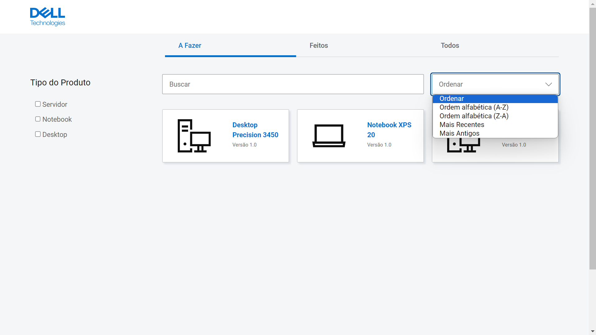<br>
<sup> Fonte: Material produzido pelos autores (2024).</sup> </div> <br>

#### Edição de Manuais

&nbsp;&nbsp;&nbsp;&nbsp;Adicionalmente, uma nova funcionalidade foi desenvolvida, permitindo a edição de manuais diretamente no sistema. Com essa atualização, é possível modificar e atualizar os manuais, incluindo alterações na descrição e nos arquivos associados. Esta funcionalidade facilita a manutenção dos manuais e garante que as informações estejam sempre atualizadas. <br>

<div align="center"> <sub> Figura 39 — Print de Tela da Funcionalidade de Edição de Manuais </sub>
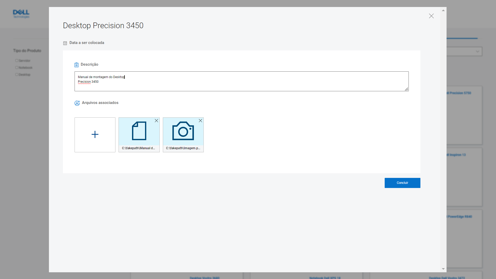<br>
<sup> Fonte: Material produzido pelos autores (2024).</sup> </div> <br>

#### Alteração no Layout do Dashboard

&nbsp;&nbsp;&nbsp;&nbsp;A principal alteração desenvolvida nesta fase foi no _layout_ do _dashboard_, tornando-o mais detalhado e completo. Inicialmente, devido ao curto período de tempo disponível para o desenvolvimento da plataforma, havia preocupação quanto à possibilidade de desenvolvimento de um dashboard completo. No entanto, com o progresso do projeto, durante a sprint 5, foi possível desenvolver um _dashboard_ de forma completa e interativa. <br>

&nbsp;&nbsp;&nbsp;&nbsp;A nova interface fornece uma visualização mais intuitiva e abrangente das informações, facilitando a análise e o acompanhamento de dados importantes. O novo design permite uma melhor disposição dos gráficos, otimizando a experiência do usuário. Nesse novo modelo, foram adicionados três tipos de gráficos: pizza, linhas e barras. Estes gráficos apresentam informações como a quantidade de manuais pendentes por linha, por material e por pessoa, além de gráficos comparativos entre a quantidade de manuais feitos e por fazer, e informações relevantes da fábrica, como a quantidade de funcionários e linhas de montagem. <br>

<div align="center"> <sub> Figura 40 — Print de Tela do Novo Layout do Dashboard </sub>
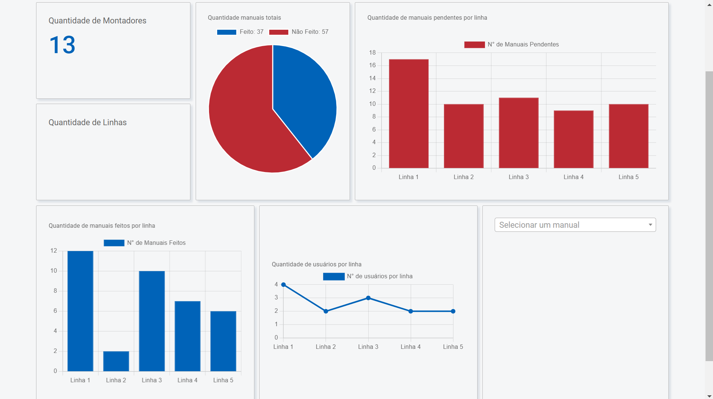<br>
<sup> Fonte: Material produzido pelos autores (2024).</sup> </div> <br>

&nbsp;&nbsp;&nbsp;&nbsp;Além das funcionalidades adicionadas, durante esta _sprint_ foram realizados testes de usabilidade, que resultaram em excelentes oportunidades de melhoria ainda não identificadas. Através desses testes, foram implementadas alterações simples, como o recarregamento da página a cada nova adição e visualização de manual, o que melhorou significativamente a experiência do usuário e aumentou a dinâmica do site. Durante a realização dos testes, também foi notada a ausência de alguns estados de _hover_, os quais foram adicionados nesta sprint para aprimorar a interatividade e a navegabilidade da interface. <br>

&nbsp;&nbsp;&nbsp;&nbsp;Em resumo, as melhorias implementadas na última versão do sistema web não apenas aprimoraram as funcionalidades de busca e edição de manuais, mas também transformaram significativamente a interface do _dashboard_, proporcionando uma experiência de usuário mais rica e eficiente. <br>

#### Dificuldades Enfrentadas

&nbsp;&nbsp;&nbsp;&nbsp;O desenvolvimento da última versão demandou um exímio esforço da equipe para atender aos prazos e manter a qualidade da aplicação, uma vez que houve uma alta demanda de tarefas concentradas nas duas últimas semanas. Entre essas demandas, uma das mais desafiadoras foi a mudança drástica no _layout_ quadro de gráficos da tela do administrador, realizada na segunda semana da quinta _sprint_. Essa alteração exigiu grandes modificações nas linhas de código do projeto e demandou um tempo extenso para testes, a fim de garantir a funcionalidade da implementação. <br>

&nbsp;&nbsp;&nbsp;&nbsp;Além disso, enfrentamos dificuldades significativas com o banco de dados, que apresentava quedas frequentes. Essa instabilidade interrompeu o fluxo de trabalho, causou atrasos consideráveis e gerou novas demandas, como a necessidade de criar um _backup_ para a repopulação do banco de dados.<br>

&nbsp;&nbsp;&nbsp;&nbsp;Apesar das dificuldades enfrentadas, as alterações necessárias foram implementadas com sucesso e a aplicação chegou à sua versão final para entrega, destacando o esforço e conhecimento do grupo no gerenciamento do projeto.<br>


# <a name="c5"></a>5. Testes

## 5.1. Relatório de testes automatizados

&nbsp;&nbsp;&nbsp;&nbsp;Testes de software verificam se o produto atende aos requisitos esperados e visam garantir que esteja livre de defeitos. Envolvem a execução de componentes de software utilizando ferramentas manuais ou automatizadas para avaliar suas propriedades. O objetivo é identificar erros, lacunas ou requisitos ausentes em relação aos requisitos reais.⁹

&nbsp;&nbsp;&nbsp;&nbsp;Um dos tipos de teste de software são os testes unitários automatizados, que testam unidades ou componentes individuais sem precisar de intervenção humana. Eles são criados e realizados durante o desenvolvimento de uma aplicação pelos desenvolvedores e isolam uma seção do código para verificar seu funcionamento.¹⁰

&nbsp;&nbsp;&nbsp;&nbsp;Com o objetivo de assegurar um nível de qualidade, segurança e satisfação adequados, a criação de testes unitários automatizados para a aplicação web DIVE foi uma etapa importante no desenvolvimento. Buscamos seguir o padrão de testes _Arrange, Act, and Assert_, pois ele gera um caminho simples e efetivo de garantir que os testes são fáceis de ler, entender e serem mantidos.

&nbsp;&nbsp;&nbsp;&nbsp;Considerando o modelo MVC e o _framework_ Sails, alguns arquivos são candidatos para serem testados com maior prioridade: _controllers_ e _views_. Os _controllers_ processam a maior parte das regras de negócio da aplicação e são responsáveis por processar as requisições, interagir com os _models_ e renderizar as _views_. As _views_, por sua vez, embora sejam responsáveis pela apresentação dos dados para os usuários, possuem algumas funções que necessitam serem testadas.

&nbsp;&nbsp;&nbsp;&nbsp;As bibliotecas utilizadas para os testes foram `mocha`, `supertest`, `sinon`, `assert` e `nyc`. O `mocha` é um framework de testes que suporta testes assíncronos, ideal para o ambiente Node.js. O `supertest` permite testar _endpoints_ HTTP, garantindo que as rotas e _controllers_ funcionem corretamente. O `sinon` oferece funcionalidades para criar mocks, stubs e spies, facilitando a simulação de dependências. O `assert` fornece uma API para realizar asserções, verificando se os resultados dos testes estão corretos. Por fim, o `nyc` cria o relatório de cobertura para os testes.

&nbsp;&nbsp;&nbsp;&nbsp;O plano inicial foi começar a implementar testes para os _controllers_ e aumentar gradativamente seu grau de cobertura. A maioria dos _controllers_ possuem os métodos `create`, `find`, `findOne`, `update` e `destroy`, de modo que seus testes podem ser replicados com pequenos ajustes. Outras funções além dessas que exigiram atenção para serem testadas são: `login` do `AuthController`, `findMaterialsByManualId` do `HandbookController` e `findDoneTask` e `findUndoneTask` do `TasksController`.

### Testes Gerais para Controllers

&nbsp;&nbsp;&nbsp;&nbsp;Os testes da tabela a seguir visam testar os métodos gerais que estão presentes em vários _controllers_ e gerenciam o fluxo de dados no bando de dados. Reparar que a definição de **/rota** listada na coluna Passos é referente ao _controller_ respectivo, por exemplo, **/user** para *UserController*.

<div align="center">
    <sub> Tabela 15: Testes gerais</sub>
</div>

| Número | Descrição do Teste  | Pré-condições | Passos | Pós-condições | Resultado Esperado |
|---|---|---|---|---|---|
| 1 | Teste para buscar todos os elementos   | Banco de dados populado com elementos | Enviar requisição GET para /rota | Lista de elementos retornada | Lista de elementos exibida corretamente  |
| 2 | Teste para buscar elemento por ID | Banco de dados com elemento específico | Enviar requisição GET para /rota/{id} | Elemento específico retornado | Elemento específico exibido corretamente |
| 3 | Teste de criação de elemento   | Elemento não existe no banco de dados   | Enviar requisição POST para /rota com dados válidos | Novo elemento criado | Novo elemento criado com sucesso   |
| 4 | Teste de atualização de elemento    | Banco de dados com elemento para atualizar | Enviar requisição PUT para /rota/{id} com dados a serem atualizados | Elemento atualizado | Elemento atualizado com sucesso|
| 5 | Teste de exclusão de elemento  | Banco de dados com elemento a ser excluído | Enviar requisição DELETE para /rota/{id} | Elemento excluído | Elemento excluído com sucesso |

<div align="center">
    <sup> Fonte: Material produzido pelos autores (2024)</sup>
</div>

&nbsp;&nbsp;&nbsp;&nbsp;A tabela anterior não é exaustiva e abrange operações essenciais de CRUD nos _controllers_, validando a busca, criação, atualização e exclusão de informações no banco de dados. Eles visam assegurar a integridade e confiabilidade das operações de gerenciamento de dados.

### Testes específicos dos controllers

**AuthController**
&nbsp;&nbsp;&nbsp;&nbsp;Esse _controller_ é responsável por verificar e autenticar o login dos usuários. Ele possui apenas o método `login` e os testes planejados para ele estão listados na tabela a seguir. Testes automatizados para autenticação via token planejam ser implementados após essa funcionalidade estar completa.

<div align="center">
    <sub> Tabela 16: Testes AuthController</sub>
</div>

| Número | Descrição do Teste | Pré-condições  | Teste  | Pós-condições | Resultado Esperado |
|--|---|---|---|---|---|
| 1  | Teste de Login com Credenciais Válidas | Usuário não autenticado  | Enviar uma solicitação de login com um email e senha válidos  | Usuário autenticado com sucesso | Login realizado com sucesso   |
| 2  | Teste de Login sem Email  | Usuário não autenticado | Enviar uma solicitação de login sem fornecer um email| Erro de requisição com status 400  | Retorno de erro indicando que o email é obrigatório |
| 3  | Teste de Login sem Senha  | Usuário não autenticado | Enviar uma solicitação de login com um email válido, mas sem fornecer uma senha   | Erro de requisição com status 400   | Retorno de erro indicando que a senha é obrigatória |
| 4  | Teste de Login com Email Inexistente   | Usuário não autenticado | Enviar uma solicitação de login com um email que não existe no banco de dados | Erro de requisição com status 404   | Retorno de erro indicando que o usuário não foi encontrado |
| 5  | Teste de Login com Senha Inválida  | Usuário não autenticado | Enviar uma solicitação de login com um email válido, mas com uma senha que não corresponde à senha cadastrada no banco de dados | Erro de requisição com status 401   | Retorno de erro indicando que a senha é inválida   |
<div align="center">
    <sup> Fonte: Material produzido pelos autores (2024)</sup>
</div>

**HandbooksController**
&nbsp;&nbsp;&nbsp;&nbsp;Esse _controller_ é responsável por gerenciar as operações CRUD relacionadas aos manuais no servidor. Além delas, ele também inclui métodos adicionais para buscar materiais associados a um manual específico e para alterar o status de leitura de um manual para um usuário. Os testes adicionais planejados para ela podem ser vistos abaixo.

<div align="center">
    <sub> Tabela 17: Testes HandbooksController</sub>
</div>

| Número | Descrição do Teste  | Pré-condições | Passos | Pós-condições | Resultado Esperado |
|--|---|---|---|---|---|
| 1 | Teste de busca materiais por ID de manual | Banco de dados populado com materiais associados a manuais | Enviar requisição GET para /materials/{manualId} | Lista de materiais retornada | Lista de materiais associados ao manual exibida corretamente  |
| 2 | Teste de atualização de status de leitura de manual | Banco de dados com tarefa a ser atualizada | Enviar requisição PUT para /tasks/updateRead com dados válidos | Tarefa atualizada | Status de leitura do manual atualizado com sucesso |

<div align="center">
    <sup> Fonte: Material produzido pelos autores (2024)</sup>
</div>

**GroupsController**
&nbsp;&nbsp;&nbsp;&nbsp;Esse _controller_ gerencia operações relacionadas às linhas de montagem. Também inclui métodos para buscar usuários específicos em uma linha de montagem. O teste abaixo é referente ao método `findUserByAssemblyLine`, importante para buscar os usuários de uma linha de montagem.

<div align="center">
    <sub> Tabela 18: Testes GroupsController</sub>
</div>

| Número | Descrição do Teste | Pré-condições | Passos | Pós-condições | Resultado Esperado  |
|--|---|---|---|---|---|
| 1  | Teste de busca usuário por linha de montagem | Banco de dados com grupos e usuários associados | Enviar requisição GET para /group/assembly-line/{linha} | Lista de IDs de usuários na linha de montagem retornada | Lista de IDs de usuários na linha de montagem exibida corretamente |

<div align="center">
    <sup> Fonte: Material produzido pelos autores (2024)</sup>
</div>

**TasksController**
&nbsp;&nbsp;&nbsp;&nbsp;Esse _controller_ gerencia operações relacionadas às _tasks_ da aplicação. Também inclui métodos para buscar manuais associados a tarefas não lidas ou lidas por um usuário específico, proporcionando uma gestão completa das tarefas e dos materiais relacionados a elas.

<div align="center">
    <sub> Tabela 19: Testes TasksController</sub>
</div>

| Número | Descrição do Teste | Pré-condições  | Passos | Pós-condições  | Resultado Esperado  |
|--|---|---|---|---|---|
| 1 | Teste de busca de tarefas não concluídas | Existência de tarefas não concluídas para o usuário | Enviar requisição GET para /users/:userId/UndoneTasks | Tarefas não concluídas encontradas | Lista de tarefas não concluídas retornada corretamente |
| 2 | Teste de busca de tarefas concluídas| Existência de tarefas concluídas para o usuário  | Enviar requisição GET para /users/:userId/DoneTasks | Tarefas concluídas encontradas | Lista de tarefas concluídas retornada corretamente  |
| 3 | Teste de Filtro de Imagens | Existência de IDs de manuais e materiais com imagens  | Enviar requisição GET para /task/:idManuais/FilterImagem | Manuais com imagens filtrados  | Lista de manuais com imagens retornada corretamente |

<div align="center">
    <sup> Fonte: Material produzido pelos autores (2024)</sup>
</div>

### Relatório de testes automatizados

&nbsp;&nbsp;&nbsp;&nbsp;Com os testes listados, a próxima etapa foi a codificação dos mesmos. Como citado anteriormente, focamos nossos esforços nos _controllers_, para validar as regras de negócio da aplicação.

&nbsp;&nbsp;&nbsp;&nbsp;É válido citar que os arquivos de testes possuem a extensão `*.test.js` e estão localizados na pasta `test\unit`. Outros dois arquivos na pasta `test`, `lifecycle.test.js` e `sinonUtils.js`, fornecem códigos imporantes para emular o `Sails.js` e guardar informações que foram utilizadas nos testes. Uma última configuração importante foi a adaptação da chamada dos testes no arquivo `package.json` como demonstrado a seguir:

```js
"scripts": {
    "test": "nyc --reporter=lcov --reporter=text --show-process-tree mocha -v test/lifecycle.test.js test/**/*.test.js",
}
```
&nbsp;&nbsp;&nbsp;&nbsp;Apenas para fins de exemplificação da utilização do padrão AAA nos testes, podemos verificar ua aplicação no trecho de código a seguir:
```js
  it("Deve retornar uma lista de IDs de usuário com sucesso", async () => {
    // Arrange
    const numeroDaLinha = 1;
    const findStub = sinon.stub(Group, "find").resolves([{ id_users: 1 }, { id_users: 2 }]);
    const req = { param: sinon.stub().returns(numeroDaLinha) };
    const res = { json: sinon.stub() };
    // Act
    await GroupsController.findUserByAssemblyLine(req, res);
    // Assert
    assert.strictEqual(findStub.calledOnce, true);
    assert.deepStrictEqual(res.json.firstCall.args[0], [1, 2]);
  });
```
&nbsp;&nbsp;&nbsp;&nbsp;Com tudo configurado, foi realizada a entrada do seguinte códido no terminal para realizar a testagem e verificar sua cobertura.
```js
  npm test
```
&nbsp;&nbsp;&nbsp;&nbsp;O resultado encontrado foi: 40 testes passaram e 16 apresentaram falha de alguma natureza. Os _controllers_ que apresentaram o maior número de falhas foram o _HandbookController_ e o _UserController_.

&nbsp;&nbsp;&nbsp;&nbsp;A figura a seguir resume a cobertura dos dados e demonstra que aproximadamente 50.68% obtiveram êxito.

<div align="center"> <sub> Figura 41 — Cobertura dos Testes </sub><br>

<sup>Fonte: Material produzido pelos autores (2024).</sup> </div><br>

&nbsp;&nbsp;&nbsp;&nbsp;Outro dado que podemos tirar da tabela acima é o número de funções ou linhas que ainda não possuem testes e suas respectivas linhas, que devem ser analizados para serem alvos dos próximos testes.

## 5.2. Testes de usabilidade

### 5.2.1 Registros de testes e melhorias

&nbsp;&nbsp;&nbsp;&nbsp;Teste de usabilidade é um método de pesquisa bastante utilizado em UX Design. Basicamente, o teste de usabilidade é necessário para entender o comportamento do usuário final quando em interação com uma interface (Guimarães, Felipe e Equipe Aela, 2020). Dessa forma, são três os principais objetivos do teste de usabilidade: identificar problemas na interface e no design do produto, descobrir oportunidades de como melhorar o produto, e aprender mais sobre o usuário, seu comportamento e suas preferências. [¹¹](#c7)

Para avaliar a usabilidade da plataforma DIVE (DELL INTERACTIVE VIRTUAL ENVIRONMENT), realizamos testes de usabilidade, nos quais definimos cinco tarefas principais que poderiam ser realizadas utilizando nossa aplicação web, sendo elas:

1. **Fazer Login**
2. **Criar Manual**
3. **Editar Manual**
4. **Acessar Manual**
5. **Atualizar Status do Manual**

O teste foi realizado com 8 usuários no total, onde eles poderiam seguir o fluxo dentro da plataforma de funcionários comuns (montadores) e administradores.

### Descrição das Etapas de Navegação

#### Tarefa 1: Fazer Login
**Enunciado:** "Suponha que você é um funcionário da Dell e precisa acessar a aplicação web utilizando suas credenciais."

**Etapas:**
1. Preencher campo de email;
2. Preencher campo de senha;
3. Clicar no botão de login.

**Resultados:**
- Todos os usuários conseguiram realizar a tarefa de login de forma fácil e rápida, indicando que nosso sistema de login é intuitivo. Um fator que facilita o processo é que os emails e senhas dos usuários já estão cadastrados no banco de dados, pois a aplicação é de acesso restrito aos funcionários da Dell. Assim, o usuário precisa apenas inserir suas credenciais no site.

#### Tarefa 2: Criar Manual
**Enunciado:** "Suponha que você é um administrador de linhas da Dell e precisa criar um manual para os montadores."

**Etapas:**
1. Achar botão de adicionar manual (+);
2. Clicar no botão de adicionar manual (+);
3. Preencher todos os campos para enviar um novo manual;
4. Escolher a linha específica do montador para atribuir o manual;
5. Clicar no botão de adicionar.

**Resultados:**
- Mais da metade dos testadores encontraram dificuldade na etapa 1, que consistia em localizar o botão de adicionar manual. Essa dificuldade foi atribuída à falta de um efeito de hover no botão e de um cursor indicando que era um elemento clicável. Esse ponto de melhoria foi implementado no projeto. As demais etapas foram realizadas com sucesso e de forma rápida pelos nossos testadores.

#### Tarefa 3: Editar Manual
**Enunciado:** "Suponha que você é um administrador de linhas da Dell e precisa atualizar um manual para os montadores."

**Etapas:**
1. Achar um manual para editar;
2. Clicar no manual;
3. Editar a descrição;
4. Aplicar edição;

**Resultados:**
- Uma das nossas usuárias encontrou dificuldade na etapa 1, sugerindo que a adição de um efeito de hover facilitaria a identificação de elementos clicáveis e editáveis. Outra usuária teve problemas na etapa 3, ao tentar atribuir o manual a mais de uma linha de produção, devido à falta de funcionalidades que permitissem essa atribuição em massa e à ausência de descrições das linhas já atribuídas. Isso tornou a aplicação mais complicada e demorada de usar, pois era necessário atribuir o manual a cada linha individualmente, sem saber quais linhas já haviam sido atribuídas. Esses pontos foram destacados como áreas prioritárias de melhoria. No entanto, os demais usuários consideraram a aplicação dinâmica e intuitiva.

#### Tarefa 4: Acessar Manual
**Enunciado:** "Suponha que você é um montador de linhas da Dell e precisa encontrar um manual que necessita fazer."

**Etapas:**
1. Achar os manuais que precisa fazer;
2. Clicar no manual.

**Resultados:**
- Apenas um dos nossos testadores encontrou dificuldade na etapa 1, que envolvia reconhecer os manuais e entender sua utilidade, além de perceber que precisava clicar neles. Um ponto de melhoria é tornar essas informações mais evidentes. Os demais testadores conseguiram realizar as duas etapas conforme o esperado, de maneira rápida e bem-sucedida.

#### Tarefa 5: Atualizar Status do Manual
**Enunciado:** "Suponha que você é um montador de linhas da Dell e precisa marcar um manual como 'lido'."

**Etapas:**
1. Marcar o manual na aba "A fazer" e marcar como lido;
2. Alterar para a aba de "Feito";
3. Acessar o manual que marcou como feito.

**Resultados:**
- Todos os usuários realizaram a tarefa rapidamente e com sucesso, indicando boa usabilidade nessa função.

### Registro dos Testes

Os testes foram realizados com 8 participantes, com fluxos entre administradores e montadores. Cada tarefa foi observada, e os resultados de sucessos e dificuldades foram registrados.

- **Tarefa 1: Fazer Login**
  - Sucesso: 8/8
  - Dificuldades: Nenhuma

<div align="center"> <sub> Figura 42 — Registro da Primeira Tarefa do Teste de Usabilidade </sub>
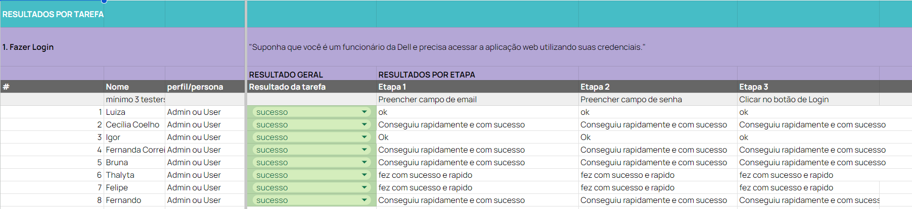<br>
<sup> Fonte: Material produzido pelos autores (2024).</sup> </div> <br>

- **Tarefa 2: Criar Manual**
  - Sucesso: 3/8
  - Dificuldades: Encontrar o botão de adicionar manual

<div align="center"> <sub> Figura 43 — Registro da Segunda Tarefa do Teste de Usabilidade </sub>
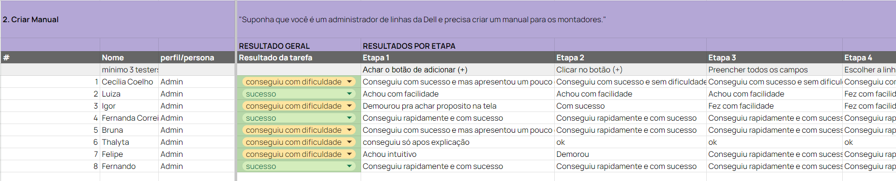<br>
<sup> Fonte: Material produzido pelos autores (2024).</sup> </div> <br>

- **Tarefa 3: Editar Manual**
  - Sucesso: 6/8
  - Dificuldades: Encontrar o manual para editar, atribuir mais de uma linha na edição

<div align="center"> <sub> Figura 44 — Registro da Terceira Tarefa do Teste de Usabilidade </sub>
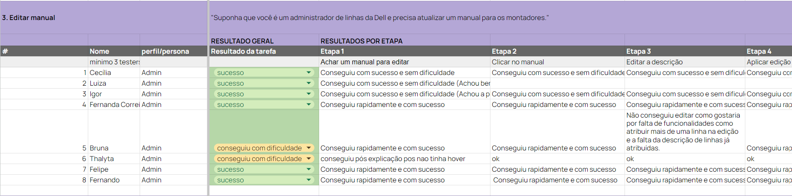<br>
<sup> Fonte: Material produzido pelos autores (2024).</sup> </div> <br>

- **Tarefa 4: Acessar Manual**
  - Sucesso: 7/8
  - Dificuldades: Reconhecer os manuais

<div align="center"> <sub> Figura 45 — Registro da Quarta Tarefa do Teste de Usabilidade </sub>
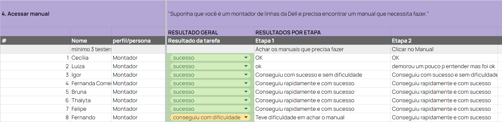<br>
<sup> Fonte: Material produzido pelos autores (2024).</sup> </div> <br>

- **Tarefa 5: Atualizar Status do Manual**
  - Sucesso: 8/8
  - Dificuldades: Nenhuma

<div align="center"> <sub> Figura 46 — Registro da Quinta Tarefa do Teste de Usabilidade </sub>
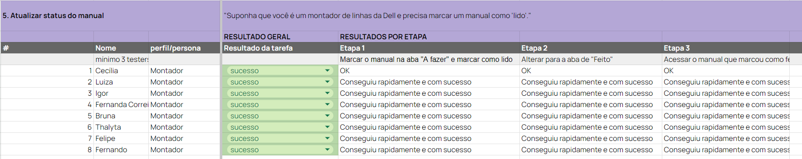<br>
<sup> Fonte: Material produzido pelos autores (2024).</sup> </div> <br>

### Prioridades de Melhoria

1. **Adicionar Hover e Cursor Indicativo no Botão de Adicionar Manual**
   - **Criticidade:** Alta
   - **Impacto:** A inclusão de um efeito de hover e um cursor indicativo no botão de adicionar manual é crucial para facilitar a identificação de elementos clicáveis. Essa melhoria torna o botão mais visível e intuitivo para os usuários, reduzindo o tempo necessário para completar essa etapa e melhorando significativamente a experiência do usuário.
   <br>

2. **Melhorar a Funcionalidade de Edição de Manuais**
   - **Criticidade:** Alta
   - **Impacto:** A funcionalidade de edição de manuais precisa permitir a atribuição de múltiplas linhas de produção simultaneamente e fornecer descrições claras das linhas já atribuídas. Atualmente, a falta dessas funcionalidades torna o processo de edição demorado e confuso. Implementar essas melhorias vai otimizar o fluxo de trabalho dos administradores, tornando a aplicação mais eficiente e fácil de usar.
   <br>

3. **Tornar Mais Óbvio o Reconhecimento e a Utilidade dos Manuais**
   - **Criticidade:** Baixa
   - **Impacto:** É interessante tornar mais evidente a utilidade e a função dos manuais para os montadores. Isso pode ser feito através de melhorias visuais com descrições mais claras que indiquem que os manuais são clicáveis e expliquem sua finalidade. Esta alteração facilitará a navegação e o uso da aplicação pelos montadores, melhorando a eficiência do trabalho e a satisfação do usuário.


### Conclusão

&nbsp;&nbsp;&nbsp;&nbsp;De maneira geral, os testes obtiveram resultados satisfatórios, sem tarefas ou etapas não concluídas pelos nossos testadores. Isso indica que a solução está proporcionando uma boa experiência do usuário. Para ter acesso a tabela oficial dos testes de usabilidade do DIVE, [clicando aqui](https://docs.google.com/spreadsheets/d/1mm-GpH6l8rf9z6TCRQRVgSd2x3bbuNWBB6doDbU0-2c/edit?usp=sharing) é possível conferir.

# <a name="c6"></a>6. Conclusões e trabalhos futuros

&nbsp;&nbsp;&nbsp;&nbsp;Pautado no objetivo de aumentar a eficiência das linhas de montagem e diminuir o tempo de aprendizagem dos funcionários sobre alterações, melhorias e ajustes nos processos de montagem, a plataforma desenvolvida demonstrou atingir seu objetivo ao fornecer uma solução simples, educativa e objetiva, que pode ser facilmente incorporada ao ambiente industrial da Dell Technologies durante a fase de treinamento de funcionários. <br>

&nbsp;&nbsp;&nbsp;&nbsp;Dentro do contexto industrial de montagem de aparelhos, a plataforma *DIVE* surge como uma opção de solução para a redução da produtividade causada pelo tempo demandado para o treinamento dos montadores. Com um *login* descomplicado e uma página de estudo com visual limpo, a aplicação reúne em um catálogo todos os manuais de montagem necessários para a montagem dos aparelhos da Dell. Visando a agilidade ao acessar a página como montador, a primeira coisa a ser vista são *cards* com os conteúdos e informações detalhadas (nome, data, versão e produto alvo) dos manuais a serem acessados, que são divididos em abas que evidenciam seu *status*: "A Fazer" e "Feito", que pode ser alterado pelo usuário, além de uma aba que reúne todos eles sem distinção. A posteriori, é possível observar a barra de pesquisa, o filtro e a caixa de ordenação, que são elementos que reforçam a *User Story T002*, facilitando encontrar manuais específicos. <br>

&nbsp;&nbsp;&nbsp;&nbsp;Acessando a página de administrador, há uma mudança na quantidade de abas e suas funcionalidades. Após passar pela tela de *login*, o engenheiro da Dell se depara com uma aba contendo todos os manuais, uma barra de pesquisa, um filtro, uma caixa de ordenação e um bloco que permite que ele adicione mais manuais. Ao clicar nesse bloco, é possível adicionar descrição, arquivos e os delegar para as linhas de montagem desejadas. Além disso, o engenheiro também tem acesso a uma aba de *dashboard* contendo estatísticas a respeito do status dos manuais em geral e o status por linha de montagem. <br>

&nbsp;&nbsp;&nbsp;&nbsp;Durante os testes, foi evidente a adequação do projeto às *User Stories* e, sendo assim, a conformidade com os resultados esperados, ressaltando os pontos fortes do projeto como a facilidade de acesso, navegabilidade intuitiva, um bom visual condizente com a identidade da Dell e um sistema conciso e limpo. Embora esses pontos estejam claros, há espaço para aprimoramento contínuo; um dos principais pontos percebidos durante os testes é a necessidade de uma melhoria no botão de adição de manual na tela do administrador, tornando-o mais intuitivo e consoante com o resto do projeto. Uma forma de alcançar isso é adicionando uma descrição abaixo do ícone. Nessa mesma tela, há também um possível ponto de melhoria no contexto de atualização de manuais, que compreende a adição de campos que sinalizem as linhas de montagem atribuídas a determinados manuais e a possibilidade de adicionar ou remover linhas. <br>

&nbsp;&nbsp;&nbsp;&nbsp;Para além das funcionalidades já testadas, algumas outras podem ser implementadas, como um campo de notificações para alertar ao montador quando um novo manual for publicado ou atualizado, uma página de gerenciamento de perfil contendo informações essenciais do funcionário, como linha, função ou matrícula, e adicionar um campo a uma funcionalidade já existente (contagem geral de montadores) que possibilite o ligamento e desligamento de funcionários das linhas de montagem. É possível também adicionar autenticação e autorização via tokens *JWT* (*JSON Web Token*) para incrementar a segurança da aplicação que foi implementada na branch ``feature/prog-Login-JWT``, mas não foi adicionada à versão final do projeto. <br>

# <a name="c7"></a>7. Referências

&nbsp;&nbsp;&nbsp;&nbsp;Abaixo, estão contidas as referências utilizadas para embasar todo o projeto, visando entender todo o cenário, não só do cliente, como do mercado ao qual o projeto está inserida.<br>

LUCK, Heloisa. Liderança em gestão escolar. 4. ed. Petrópolis: Vozes, 2010. <br>
SOBRENOME, Nome. Título do livro: subtítulo do livro. Edição. Cidade de publicação: Nome da editora, Ano de publicação. <br>

INTELI. Adalove. Disponível em: https://adalove.inteli.edu.br/feed. Acesso em: 1 out. 2023 <br>
SOBRENOME, Nome. Título do site. Disponível em: link do site. Acesso em: Dia Mês Ano

¹ Dell. Canaltech. Disponível em: <https://canaltech.com.br/empresa/dell/>. Acesso em: 23 abr. 2024 <br>

² GARGIONI, Antônio. Estratégia da Dell. COMPANY, 2023. Disponível em: <https://v4company.com/blog/cases-de-marketing/estrategia-da-dell>. Acesso em: 16 de abr. de 2024. <br>

³ O QUE é padrão MVC? Entenda arquitetura de softwares!. [S. l.], 17 jul. 2020. Disponível em: <https://blog.lewagon.com/pt-br/skills/o-que-e-padrao-mvc/>. Acesso em: 26 abr. 2024.<br>

⁴ GUIMARAES, Felipe. Style Guide: Como Desenvolver o Guia de Estilo da Sua Interface?. Disponível em: https://aelaschool.com/pt/designvisual/style-guide-como-desenvolver-o-guia-de-estilo-da-sua-interface/. Acesso em: 2 mai. 2024.<br>

⁵ Dell Technologies. Dell Design System. Disponível em: https://www.delldesignsystem.com. Acesso em: 10 mai. 2024.<br>

⁶ EightShapes LLC. Contrast Grid. Disponível em: http://contrast-grid.eightshapes.com. Acesso em: 12 maio 2024.<br>

⁷ W3C. Web Content Accessibility Guidelines (WCAG) 2.0. Disponível em: https://www.w3.org/TR/WCAG20/. Acesso em: 10 mai. 2024.<br>

⁸ W3C. Web Content Accessibility Guidelines (WCAG) 2.1. Disponível em: https://www.w3.org/TR/WCAG21/. Acesso em: 10 mai. 2024.<br>

⁹ GURU99. Guia de Teste Unitário. Portal de Tutoriais, Disponível em: <https://www.guru99.com/pt/unit-testing-guide.html>. Acesso em: 09 jun. 2024.

¹⁰ GURU99. Introdução ao Teste de Software: Importância e Conceitos. Portal de Tutoriais, Disponível em: <https://www.guru99.com/pt/software-testing-introduction-importance.html>. Acesso em: 10 jun. 2024.

¹¹ GUIMARAES, Felipe. Teste De Usabilidade: Como Preparar e Conduzir?. Disponível em: https://aelaschool.com/pt/research/teste-de-usabilidade-como-preparar-e-conduzir/. Acesso em 20 jun. 2024.

¹ ² ³ ⁴ ⁵ ⁶ ⁷ ⁸ ⁹ ⁰


# <a name="c8"></a>Anexos

## 1. Figma

&nbsp;&nbsp;&nbsp;&nbsp;O *website* Figma foi utilizado para a concepção gráfica da aplicação web.

* [Figma](https://www.figma.com/)<br>

&nbsp;&nbsp;&nbsp;&nbsp;Através desta ferramenta, foi possível criar o wireframe, o guia de estilos e o protótipo de alta fidelidade.

